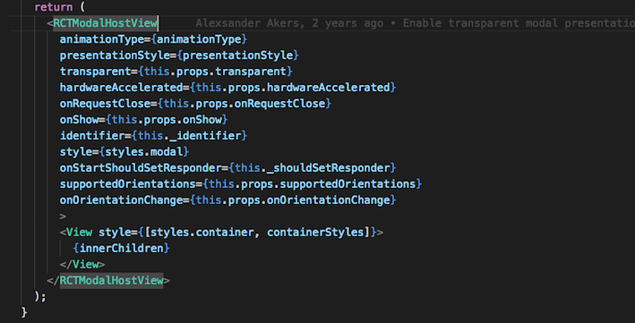

# React Native 底层原理

  通过前面几章, 对 React Native 的发展、语法、架构等都有了一定的了解, 熟悉了这些之后也应该能够独立的构建一个应用, 但是 React Native 的原理还是应该明白的, 毕竟轮子是别人的, 知识是自己的, 只有明白的 React Native 的底层原理, 才有可能自己造轮子, 退一万步讲, 明白了原理, 用起 React Native 这门框架来才能够行云流水, 这一章, 主要是对 React Native 的底层原理做一些探究, 并用 RN 中的组件当作例子来深挖 React Native.

  Android 和 IOS 不一定要分开讲述, 因为 React Native 处理 Android 和 IOS 的时候用的都是同一套逻辑, 就是用 `JavaScript` 去调用原生 API, 而且 React Native 将原生接口都封装好了, 使用同一个组件, Android 下和 IOS 下的 UI 是差不多一模一样的, 但是 Android 和 IOS 有太多的不同点了, 包括语言, 包括布局, 因此 React Native 不能够保证所有的 API 在 Android 和 IOS 下都是一样的效果, 因为将两种不同的操作系统联系在一起本身就很难了, 不过随着 React Native 的发展, 从 0.19 到现在的0.48, RN 修复了很多 bug, 在两个系统的兼容性上面也越来越好了

  ## 简述 RN 原理

React Native 是在 Native App 里面引入了一个脚本语言, 就像 JavaScript 在 `遥控` 一个 Native App. React Native 会在一开始生成 OC 模块表, 然后将这个模块表导入 JavaScript 中, JS 参照模块表, 就能够间接的调用 OC 的代码, 这样说可能有一些抽象, 举个例子: 相当于买了一台电视机(OC), 有一个遥控板, 当我们拿着遥控板按下1, 它就跳到1频道, 按下2, 它就跳到2频道, 我们并不需要知道为什么按1电视机就跳转到1频道, 也不需要知道它是怎么跳转到1频道的, 这些制造这台电视的工程师们已经帮我们封装好了这些操作, 设定1代表的是1频道, 2代表的是2频道. React Native 也是一样的, 其实 App 底层的实现都是`原生 API`, 但是 React Native 帮我们封装好了很多的操作, 而且对应有一份 OC 表, 我们只需要对着 React Native 封装好的说明书来就可以了, 因此, 使用 React Native 开发出来的就是 原生的 App 了

## JavaScript 语言与 Native 语言的交互

IOS 原生 API 有一个 JavaScriptCore 框架, 通过它就能够实现 JavaScript 和 Object-C 的交互, 当我们写好 JSX 代码后, 经过解析会将 JSX 代码编译为 JavaScript 代码, 之后呢, Object-C 读取 JavaScript 并利用 JavaScriptCore 执行, 执行完毕会返回一个数组, 数组中描述 Object-C 对象, 属性, 方法等等.

Android 与IOS 类似, 不过它并不像IOS 那样, 有 JavaScriptCore 框架能够直接解析 JS 代码, 在 Android 的实现中, 一共分为三层, JS, C++, JAVA. 首先是 JS 层, 当我们使用 React Native 框架将页面写好之后, 经过编译就会得到纯的 JS 文件, 之后就是 JS 与 C++ 层的交互了, C++ 中的 JSCExecutor 模块能够加载和执行 JS 代码, 其功能与 IOS 的 JavaScriptCore 框架类似, 通过 JsToNativeBridge 与 JAVA 层交互, 至于跨语言之间的通信暂时可不深究.

## React Native 启动流程(IOS)

1.创建RCTRootView -> 设置窗口根控制器的View,把RN的View添加到窗口上显示。

2.创建RCTBridge -> 桥接对象,管理JS和OC交互，做中转左右。

3.创建RCTBatchedBridge -> 批量桥架对象，JS和OC交互具体实现都在这个类中。

4.执行[RCTBatchedBridge loadSource] -> 加载JS源码

5.执行[RCTBatchedBridge initModulesWithDispatchGroup] -> 创建OC模块表

6.执行[RCTJSCExecutor injectJSONText] -> 往JS中插入OC模块表

7.执行完JS代码，回调OC，调用OC中的组件

8.完成UI渲染

## React Native 加载源码流程(IOS)

拿一个组件去解释, 贴几张图
## Android
  1. ...
  2. ...
  3. ...
  4. ...
  5. ...
  6. 小结
## IOS
  1. ...
  2. ...
  3. ...
  4. ...
  5. ...
  6. 小结
## 本章小结
  1. ...
  2. ...
  3. ...

就像人饿了就要吃饭, 醒了就应该敲代码.