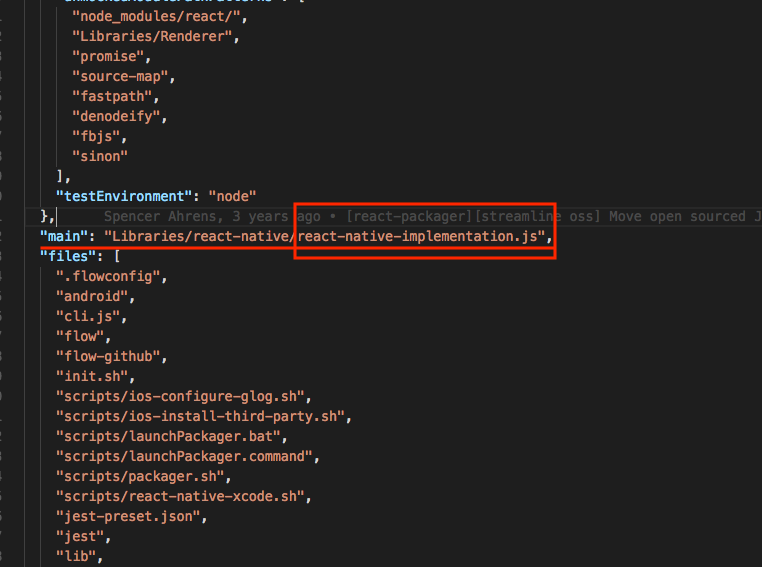

# React Native 源码解读


`Clone with SSH`: **`git@github.com:facebook/react-native.git`**


`Clone with HTTPS`: **`https://github.com/facebook/react-native.git`**

以上两种方式都可 `Clone` 源码, 研究 React Native 源码一方面是为了 `论文`, 与此相关, 另一方面是想搞清楚 `React Native` 的移动端实现原理.

一. `Clone` 下来的文件夹里面现先看了一下 `README.md` 文件, 罗列几点:

1. Learn once, write anywhere(学习一次, 随时随地去写)

2. Supported operating system are `>= Android 4.1(API 16)` and `>= IOS 8.0`(支持的操作系统: >= Android4.1 API 16 和 IOS 8.0)

3. Build native mobile apps using `JavaScript` and `React`; A `React Native App` is a **real** `mobile app`; Don't waste time recompiling; Use native code when you need to(使用 `JavaScript` 和 `React` 构建原生移动 App; `React Native App` 是真正的移动应用程序; 不用浪费时间去重编译; 当你需要的时候页还可以使用 `原生代码` )

4. Another great way to learn more about the components and APIs included with React Native is to read their source, Look under the `Libraries/Components` directory for components like **ScrollView** and **TextInput**(了解更多关于 `React Native` 的 `组件` 和 `API` 的方法是 读它的源码, 在 `Libraries/Components` 文件夹下有像 `ScrollView` 和 `TextInput` 的组件)

二. `大致` 浏览了 `package.json` 文件, 了解 `React Native` 包的入口文件是 `Libraries/react-native/react-native-implementation.js`



`react-native-implementation.js` 中都是引入的包文件, 分为 `五个部分`:
1. `Components` (组件).
    - 里面包含了所有的 `RN` 组件, 有: `AccessibilityInfo`, `ActivityIndicator`, `ART`, `Button`, `CheckBox`, `DatePickerIOS`, `DrawerLayoutAndroid`, `FlatList`, `Image`, `ImageBackground`, `ImageEditor`, `ImageStore`, `KeyboardAvoidingView`, `ListView`, `MaskedViewIOS`, `Modal`, `NavigatorIOS`, `Picker`, `PickerIOS`, `ProgressBarAndroid`, `ProgressBarIOS`, `SafeAreaView`, `ScrollView`, `SectionList`, `SegmentedControlIOS`, `Slider`, `SnapShotViewIOS`, `Switch`, `RefreshControl`, `StatusBar`, `SwipeableFlatList`, `SwipeableListView`, `TabBarIOS`, `Text`, `TextInput`, `ToastAndroid`, `ToolbarAndroid`, `Touchable`, `TouchableHighlight`, `TouchableNativeFeedback`, `TouchableOpacity`, `TouchableWithoutFeedback`, `View`, `ViewPagerAndroid`, `VirtualizedList`, `WebView`
2. `APIs` (API).Application Programing Interface
    - 包含了所有的API, 有: `ActionSheetIOS`, `Alert`, `AlertIOS`, `Animated`, `AppRegistry`, `AppState`, `AsyncStorage`, `BackAndroid`, `BackHandler`, `CameraRoll`, `Clipboard`, `DatePickerAndroid`, `DeviceInfo`, `Dimensions`, `Easing`, `findNodeHandle`, `I18nManager`, `ImagePickerIOS`, `InteractionManager`, `Keyboard`, `LayoutAnimation`, `Linking`, `NativeEventEmitter`, `NetInfo`, `PanResponder`, `PermissionsAndroid`, `PixelRatio`, `PushNotificationIOS`, `Settings`, `Share`, `StatusBarIOS`, `StyleSheet`, `Systrace`, `TimePickerAndroid`, `TVEventHandle`, `UIManager`, `unstable_batchedUpdates`, `Vibration`, `VibrationIOS`, `YellowBox`
3. `Plugins`(插件).
    - 包含一些常用的插件, 有: `DeviceEventEmitter`, `NativeAppEventEmitter`, `NativeModules`, `Platform`, `processColor`, `requireNativeComponent`, `takeSnapShot`
4. `Prop Types`(类型校验).
    - 包含一些常用的类型校验包, 有: `ColorPropType`, `EdgeInsetsPropType`, `PointPropType`, `ViewPropTypes`
5. `deprecated`(已经弃用).
    - 有: `Navigator`

```JavaScript
'use strict';

const invariant = require('fbjs/lib/invariant');

// Export React, plus some native additions.
const ReactNative = {
  // Components
  get AccessibilityInfo() { return require('AccessibilityInfo'); },
  get ActivityIndicator() { return require('ActivityIndicator'); },
  get ART() { return require('ReactNativeART'); },
  get Button() { return require('Button'); },
  get CheckBox() { return require('CheckBox'); },
  get DatePickerIOS() { return require('DatePickerIOS'); },
  get DrawerLayoutAndroid() { return require('DrawerLayoutAndroid'); },
  get FlatList() { return require('FlatList'); },
  get Image() { return require('Image'); },
  get ImageBackground() { return require('ImageBackground'); },
  get ImageEditor() { return require('ImageEditor'); },
  get ImageStore() { return require('ImageStore'); },
  get KeyboardAvoidingView() { return require('KeyboardAvoidingView'); },
  get ListView() { return require('ListView'); },
  get MaskedViewIOS() { return require('MaskedViewIOS'); },
  get Modal() { return require('Modal'); },
  get NavigatorIOS() { return require('NavigatorIOS'); },
  get Picker() { return require('Picker'); },
  get PickerIOS() { return require('PickerIOS'); },
  get ProgressBarAndroid() { return require('ProgressBarAndroid'); },
  get ProgressViewIOS() { return require('ProgressViewIOS'); },
  get SafeAreaView() { return require('SafeAreaView'); },
  get ScrollView() { return require('ScrollView'); },
  get SectionList() { return require('SectionList'); },
  get SegmentedControlIOS() { return require('SegmentedControlIOS'); },
  get Slider() { return require('Slider'); },
  get SnapshotViewIOS() { return require('SnapshotViewIOS'); },
  get Switch() { return require('Switch'); },
  get RefreshControl() { return require('RefreshControl'); },
  get StatusBar() { return require('StatusBar'); },
  get SwipeableFlatList() { return require('SwipeableFlatList'); },
  get SwipeableListView() { return require('SwipeableListView'); },
  get TabBarIOS() { return require('TabBarIOS'); },
  get Text() { return require('Text'); },
  get TextInput() { return require('TextInput'); },
  get ToastAndroid() { return require('ToastAndroid'); },
  get ToolbarAndroid() { return require('ToolbarAndroid'); },
  get Touchable() { return require('Touchable'); },
  get TouchableHighlight() { return require('TouchableHighlight'); },
  get TouchableNativeFeedback() { return require('TouchableNativeFeedback'); },
  get TouchableOpacity() { return require('TouchableOpacity'); },
  get TouchableWithoutFeedback() { return require('TouchableWithoutFeedback'); },
  get View() { return require('View'); },
  get ViewPagerAndroid() { return require('ViewPagerAndroid'); },
  get VirtualizedList() { return require('VirtualizedList'); },
  get WebView() { return require('WebView'); },

  // APIs
  get ActionSheetIOS() { return require('ActionSheetIOS'); },
  get Alert() { return require('Alert'); },
  get AlertIOS() { return require('AlertIOS'); },
  get Animated() { return require('Animated'); },
  get AppRegistry() { return require('AppRegistry'); },
  get AppState() { return require('AppState'); },
  get AsyncStorage() { return require('AsyncStorage'); },
  get BackAndroid() { return require('BackAndroid'); }, // deprecated: use BackHandler instead
  get BackHandler() { return require('BackHandler'); },
  get CameraRoll() { return require('CameraRoll'); },
  get Clipboard() { return require('Clipboard'); },
  get DatePickerAndroid() { return require('DatePickerAndroid'); },
  get DeviceInfo() { return require('DeviceInfo'); },
  get Dimensions() { return require('Dimensions'); },
  get Easing() { return require('Easing'); },
  get findNodeHandle() { return require('ReactNative').findNodeHandle; },
  get I18nManager() { return require('I18nManager'); },
  get ImagePickerIOS() { return require('ImagePickerIOS'); },
  get InteractionManager() { return require('InteractionManager'); },
  get Keyboard() { return require('Keyboard'); },
  get LayoutAnimation() { return require('LayoutAnimation'); },
  get Linking() { return require('Linking'); },
  get NativeEventEmitter() { return require('NativeEventEmitter'); },
  get NetInfo() { return require('NetInfo'); },
  get PanResponder() { return require('PanResponder'); },
  get PermissionsAndroid() { return require('PermissionsAndroid'); },
  get PixelRatio() { return require('PixelRatio'); },
  get PushNotificationIOS() { return require('PushNotificationIOS'); },
  get Settings() { return require('Settings'); },
  get Share() { return require('Share'); },
  get StatusBarIOS() { return require('StatusBarIOS'); },
  get StyleSheet() { return require('StyleSheet'); },
  get Systrace() { return require('Systrace'); },
  get TimePickerAndroid() { return require('TimePickerAndroid'); },
  get TVEventHandler() { return require('TVEventHandler'); },
  get UIManager() { return require('UIManager'); },
  get unstable_batchedUpdates() { return require('ReactNative').unstable_batchedUpdates; },
  get Vibration() { return require('Vibration'); },
  get VibrationIOS() { return require('VibrationIOS'); },
  get YellowBox() { return require('YellowBox'); },

  // Plugins
  get DeviceEventEmitter() { return require('RCTDeviceEventEmitter'); },
  get NativeAppEventEmitter() { return require('RCTNativeAppEventEmitter'); },
  get NativeModules() { return require('NativeModules'); },
  get Platform() { return require('Platform'); },
  get processColor() { return require('processColor'); },
  get requireNativeComponent() { return require('requireNativeComponent'); },
  get takeSnapshot() { return require('takeSnapshot'); },

  // Prop Types
  get ColorPropType() { return require('ColorPropType'); },
  get EdgeInsetsPropType() { return require('EdgeInsetsPropType'); },
  get PointPropType() { return require('PointPropType'); },
  get ViewPropTypes() { return require('ViewPropTypes'); },

  // Deprecated
  get Navigator() {
    invariant(
      false,
      'Navigator is deprecated and has been removed from this package. It can now be installed ' +
      'and imported from `react-native-deprecated-custom-components` instead of `react-native`. ' +
      'Learn about alternative navigation solutions at http://facebook.github.io/react-native/docs/navigation.html'
    );
  },
};

module.exports = ReactNative;

```


换句话说: `React Native` 的所有点都列在上面, 想要研究透 `RN` , 上面的必须看明白, 接下来的重点就是看上面的 `Components`, `APIs`, `Plugins`, `Prop Types` ..


三. `Components` 解读

1. `AccessbilityInfo`


2. `ActivityIndicator`


3. `ART`