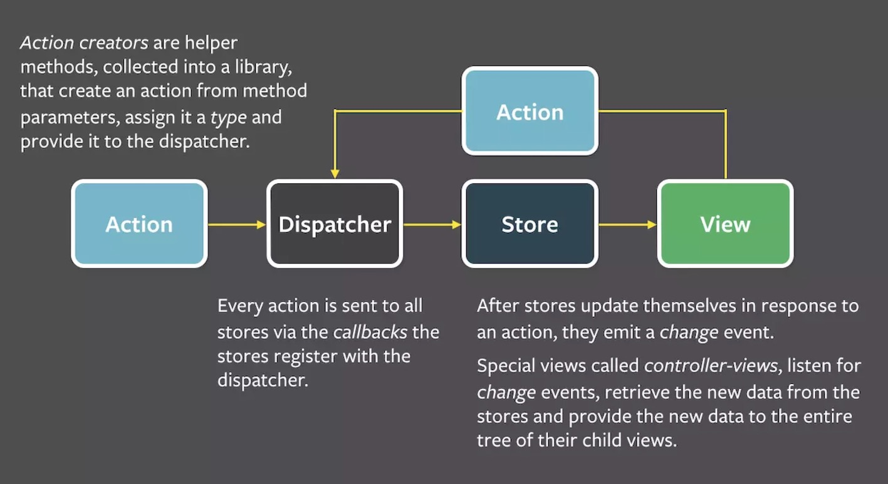

# ReactNative架构
  没写
## Flux架构
写完了, 不过可以添加一些

  1. Flux的解决方案
      1. Flux 同样是 FB 工程师提出的, Flux 主要是针对前端 MVC 框架的局限总结出来的基于 dispatcher 的前端应用架构模式.

      2. 我们知道, React 也推崇单向数据流的, 而在 Flux 中, 单向数据流则是在整体架构之上, 数据从 action, dispatcher, 再到 store, 最后回到view这一过程是单向且不可逆的, 因此不会像 MVC 那样互相交错联系.
      3. Flux 作为一种全新的前端架构方式给我们带来了思想上的冲击与转变, Flux 强调单向数据流, 强调谨慎可追溯的数据变动, 这些约束和设计都使愈来愈复杂的前端应用不会失去清晰的逻辑和架构.

  2. Flux 的概念
      1. Flux 是 FackBook 用来创建客户端 web 应用的一种架构模式, 使用单向数据流方式实现了 React 组件的复合和通信. 一个 Flux 应用由三大部分组成: dispatcher, store, view, dispatcher 负责分发时间, store 负责保存数据, view 负责
      2. 说到架构模式, MVVM, MVC这些就浮现出来了, Flux 架构和 MVC 架构比较相似, 但是在 Flux 中没有一个明确的 Controller, 而是由一个 controller-view, 将 view 和 store 绑定在一起, 因此没有 MVC 中 controller 特别复杂的逻辑
      3. ...
  3. Flux 核心思想

    Flux 的核心思想就是 `数据和逻辑永远单向流动`

    `Flux 流程图例子3..5.6.6`

      1. Flex 架构比较优雅, 简洁, 中心化控制, 让所有的请求与改变都只能通过 action 发出, 并由 dispatcher 来分发, 这样的话 View 不仅 很简洁明了, 而且还不用关心过多的逻辑而导致高度耦合, 只需要关心传入的数据, 传统的 MVC 架构虽然分层很明确, Model , View, Controller, 三者各司其职, Controller 控制器负责将 数据层(Model) 和 视图层(View) 连在一起, 但是由于 Controller 常常因为逻辑太多而造成维护不便, 而且过重的页面逻辑不利于追查问题.
      2. 此外, Flux 把 action 做了统一的归纳, 提高了系统抽象程度, 不管 action 从客户端还是服务端还是应用本身的行为, 对于我们来说, 它只是一个动作而已, 因此分的太开不一定是好事, 也就是常说的低内聚, 高耦合. 这一点, , Flux 要优雅的多

  4. ...
  5. ...
  6. 小结

## Redux架构
没写
  1. ...
  2. ...
  3. ...
  4. ...
  5. ...
  6. 小结
## 高阶架构
没写
  1. ...
  2. ...
  3. ...
  4. ...
  5. ...
  6. 小结
## 本章小结
  1. ...
  2. ...
  3. ...