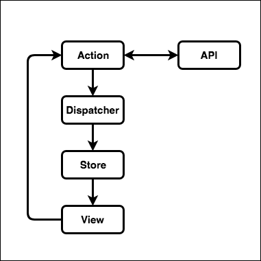
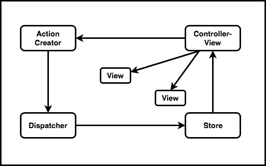
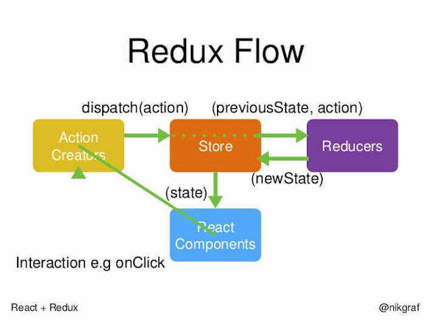

# ReactNative架构`第三章`
  在 Flux 出现之前, 前端架构模式一般都为 MV*, 其中具有代表性的是 MVC 和 MVVM, 其中MVVM 是由MVC演变过来的, MVC 强制将业务数据(Model) 和 用户界面(View)隔离, 用 控制器 (Controller) 管理逻辑. 但是随着项目越来越大, 逻辑越来越复杂的时候数据流动就很会混乱, 不便于管理, 因此需要更好的解决方案来适应越来越复杂的移动端应用.
## Flux架构`3.1`

在 Flux, Redux 等应用程序架构出现之前, 我们了解的更多的应该是前端 MV* 架构, 不得不说, 是 React 和 React Native 带火了 Flux, Redux. 那么 Flux, Redux 到底是什么呢? 本章将与您一起探讨.

  1. Flux的解决方案`3.1.1`
      1. Flux 同样是 FackBook 工程师提出的, Flux 主要是针对前端 MVC 框架的局限总结出来的基于 dispatcher 的前端应用架构模式.

      2. 我们知道, React 也推崇单向数据流的, 而在 Flux 中, 单向数据流则是在整体架构之上, 数据从 action, dispatcher, 再到 store, 最后回到view这一过程是单向且不可逆的, 因此不会像 MVC 那样互相交错联系.
      3. Flux 作为一种全新的前端架构方式给我们带来了思想上的冲击与转变, Flux 强调单向数据流, 强调谨慎可追溯的数据变动, 这些约束和设计都使愈来愈复杂的前端应用不会失去清晰的逻辑和架构.



  2. Flux 的概念`3.1.2`

一个完整的 Flux 应用由三部分组成, 分别是: store, view, dispatcher. 在这其中, store 负责储存、响应、更新数据, 而 view 呢则掌管 store 里面的数据, 并使用这些数据渲染页面, 而dispatcher 则类似于事件分发机, 负责分发事件.


      1. Flux 是 FackBook 用来创建客户端 web 应用的一种架构模式, 使用单向数据流方式实现了 React 组件的复合和通信. 一个 Flux 应用由三大部分组成: dispatcher, store, view. dispatcher 负责分发时间, store 负责保存数据, view 负责
      2. 说到架构模式, MVVM, MVC这些就浮现出来了, Flux 架构和 MVC 架构比较相似, 但是在 Flux 中没有一个明确的 Controller, 而是由一个 controller-view, 将 view 和 store 绑定在一起, 因此没有 MVC 中 controller 特别复杂的逻辑
  3. Flux 核心思想`3.1.3`

    Flux 的核心思想就是 `数据和逻辑永远单向流动`


    `Flux 流程图例子3..5.6.6`
  

      1. Flex 架构比较优雅, 简洁, 中心化控制, 让所有的请求与改变都只能通过 action 发出, 并由 dispatcher 来分发, 这样的话 View 不仅 很简洁明了, 而且还不用关心过多的逻辑而导致高度耦合, 只需要关心传入的数据, 传统的 MVC 架构虽然分层很明确, Model , View, Controller, 三者各司其职, Controller 控制器负责将 数据层(Model) 和 视图层(View) 连在一起, 但是由于 Controller 常常因为逻辑太多而造成维护不便, 而且过重的页面逻辑不利于追查问题.
      2. 此外, Flux 把 action 做了统一的归纳, 提高了系统抽象程度, 不管 action 从客户端还是服务端还是应用本身的行为, 对于我们来说, 它只是一个动作而已, 因此分的太开不一定是好事, 也就是常说的低内聚, 高耦合. 这一点, , Flux 要优雅的多

  4. 小结`3.1.4`

  本节主要介绍了 flux, flux 为了防止项目的复杂数据流向混乱, 从而利用 React 数据单向流动的特性, 限定数据从 action, dispatcher, 再到 store, 最后回到view这一过程是单向且不可逆, 数据流动相对一致.
## Redux架构`3.2`

  Flux 为了解决 MVC 架构出现的逻辑过重且互相牵连导致高耦合的缺点而设计出了基于 dispatcher的单向数据流的前端架构, 受到了越来越多的关注, 但是, Flux 本身也存在着一些问题, 因此, 很多编程爱好者尝试这优化和扩展 Flux 架构, 比如 reflux, fluxxor等等, 在众多新的解决方案当中, Redux 脱颖而出, 而且几个月内就在 Github 上面获得了近万的 star.

  1. 什么是 Redux?`3.2.1`



  Redux 可以理解成一个库, 但是思想与 Flux 类似, 只是解决了 Flux 的一些缺陷, 去除了 Flux 中许多冗余的部分, 同时引入了函数式编程的思想, Redux 将自己定位成一个容器, 提供一些 API 让我们用 reducer创建store, 更新 store 中的数据或获取 store 中最新的状态.

  2. Redux 三大原则`3.2.2`
      1. 单一数据源

  Redux 的思想是一个应用永远只有一个唯一的数据源, 并将一个应用的所有的状态都保存在一个对象中, 这样就可以随时获取整个应用的状态进行持久化.
      2. 状态只读

  在 Flux 中为了防止数据逻辑冗乱, 负责保存数据的 store 只有 getter 没有 setter, 而在 Redux 中, 根本没有 store, reducer 取代了它, reducer 根据当前触发的 action 对当前应用的 state 进行迭代.
      3. 状态修改由纯函数完成

  在 Redux 中, reducer 确定状态的修改, 每一个 reducer 都是纯函数, 接受一个输入必定会有输出. 这样设计的好处在于 reducer 对状态的修改变得更加简单、存粹、可测试
  3. Redux核心 API`3.2.3`

```JavaScript

  import { createStore } from 'redux'
  const store = createStore(reducers)

```
通过 createStore 方法创建的 store 是一个对象, 本身包含四个方法

  - getState()  获取 store 中当前的状态
  - dispatch(action) 分发一个 action, 并返回这个 action, 这是唯一能够改变 store 中数据的方式
  - subscribe(listener) 注册一个监听器, 它在 store 发生变化时被调用
  - replaceReducer(nextReducer) 更新当前 store 里面的 reducer

我们常用到的是 getState() 和 dispatch()
  4. 小结`3.2.4`

  本小节介绍了 Redux , 三大原则单一数据源, 状态只读, 状态修改由纯函数完成, 保证三大原则是为了数据和状态的正常流动, 和一些常用的 API.
## 本章小结`3.3`
  1. ...
  2. ...
  3. ...


[2]陈屹. 深入React技术栈....