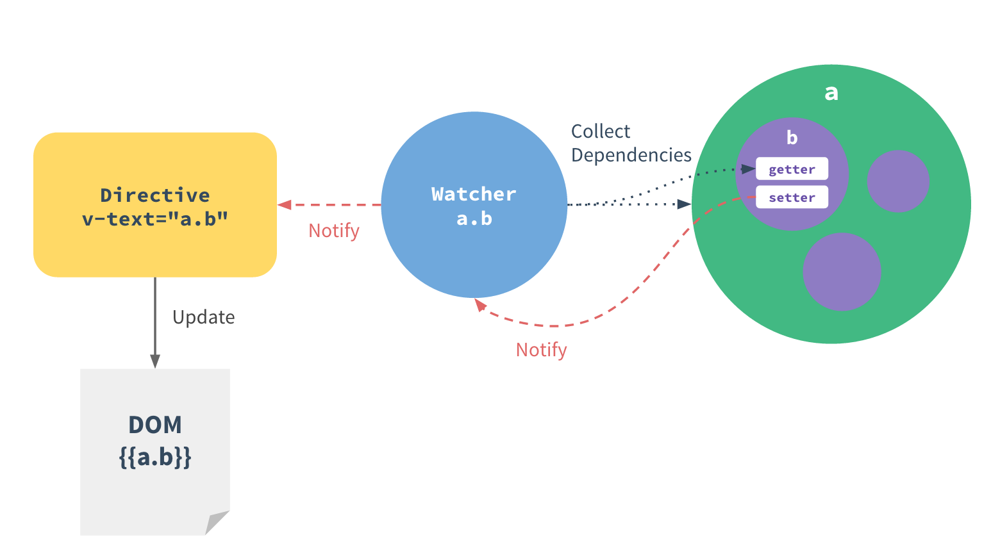

# Vue 总结

`Vue` 框架最关键的是双向绑定, 而双向绑定就两句话: 视图(View) 和 JavaScript 对象(Model) 任意一方有了变化另一方都会自动更新; 而两者之间靠声明式的 `directive` 绑定相互关系

1. 数据驱动

Vue.js 的核心是一个响应的数据绑定系统, 它让 `数据` 和 `DOM` 保持同步很简单. 在使用 `Vue` 开发项目的时候, 我们在普通 `HTML` 模版中使用特殊的语法将 `DOM` 绑定 到底层数据, 一旦创建绑定后, `DOM` 将与数据保持同步. 这样的话我们应用中的逻辑几乎都是直接修改数据而不必与 `DOM` 更新搅在一起, 让代码更容易理解和维护.

2. 双向绑定


个人对 `Vue` 的理解是让 `DOM` 与 `数据` 形成一个类似于函数映射的关系, 我们知道, 在数学中, 函数的定义是: 输入值集合中的 `每一项` 元素皆能对应 `唯一一项` 输出值集合的元素. 先暂且不用管 `DOM` 和 `数据` 谁是自变量, 谁是函数值, 它们之间任意一个发生改变, 另一个也会跟着一起改变, 这就是 `Vue` 的响应数据绑定的原理. 其次, `Vue.js` 由数据驱动 `web` 界面的一个库, 也就是说, 数据更替从而使得 `DOM` 的变化, 从而达到了 `web` 界面刷新的效果.

3. 组件系统


对于组件可能很多人都不陌生, 现在的前端框架基本都有组件这一说, `Vue` 组件是提供了一种抽象, 让我们可以用独立的可复用的小组件来构建复杂的大型应用. 组件的好处很多, 第一, 高可用, 减少重复性操作. 第二, 组件一般都定义为自定义组件, 组件间的数据流和组件内部的数据流严格区分开, 方便管理和维护.

4. Vue 实例

每个 Vue.js 应用的起步都是通过构造函数 `Vue` 创建一个 Vue的根实例.

```JavaScript

  let vm = new Vue({
    // ...
  })

```

一个 Vue 实例就是 MVVM 模式中描述的 `ViewModel`. 在实例化 Vue 时, 需要传入一个选项对象, 它包含数据、模版、挂载元素、方法、生命周期函数等选项.

Vue 实例暴露出一些实例属性和方法, 这些属性和方法都有前缀 $, 以便与代理的数据属性区分.

```JavaScript

  let data = {
    a: 1
  }
  let vm = new Vue({
    el: '#div1',
    data
  })

  vm.$data === data // -> true
  vm.$el === document.getElementById('div1') // -> true

```
> `Vue` 生命周期


`Vue` 生命周期函数是 `Vue 实例` 在创建时一系列的初始化步骤, 建立数据观察、编译模版、创建必要的数据绑定等时调用的生命周期钩子.


> `Vue` 计算属性

在模板中绑定表达式很方便, 但是只用于简单的操作, 模板只是为了描述视图的结构, 太多的逻辑会让模板过重且难以维护, 如果需要多个表达式的逻辑, 就可以使用 `计算属性` .


```
  <div id='example'>
    a={{ a }}, b = {{ b }}
  </div>

  let vm = new Vue({
    el: '#example',
    data: {
      a: 1
    },
    computed: {
      b: function () {
        return this.a + 1
      }
    }
  })

  // result
  a = 1, b = 2


```

> 计算属性 vm.$watch

Vue.js 提供了一个方法 `$watch` , 用于观察 Vue 实例上的数据变动.

```
  <div id='example'>{{ fullName }}</div>

  let vm = new Vue({
    el: '#example',
    data: {
      firstName: 'Frank',
      lastName: 'Wu',
      fullName: 'Frank Wu'
    }
  })

  vm.$watch('firstName', function (val) {
    this.fullName = val + ' ' + this.lastName
  })
  
  vm.$watch('lastName', function (val) {
    this.fullName = this.firstName + ' ' + val
  })
```

如果用 `computed` 计算属性的话是这样的:

```JavaScript

  let vm = new Vue({
    el: '#example',
    data: {
      firstName: 'Frank',
      lastName: 'Wu'
    },
    computed: {
      fullName: function () {
        return this.firstName + ' ' + this.lastName
      }
    }
  })

```


> `props`

        1. 使用 `props` 传递数据

组件实例的作用域是孤立的. 不能在自组件的模板里面直接引用副组件的数据, 需要 使用 `props` 把数据传递给子组件

`props` 是组件数据的一个字段, 期望从父组件传下来, 子组件需要显式地用 `props` 选项声明 `props`:

```JavaScript

  Vue.component('child', {
    props: ['msg'],
    template: '<span>{{ msg }}</span>'
  })

```

然后可以就可以传入数据了: 

`<child msg='morning!'></child>`

props 默认是单向绑定的, 当父组件的属性变化时, 传递给子组件, 但是不会反过来, 这是为了防止子组件无意修改了父组件的状态--这会让应用的数据流难以理解. 不过, 也可以使用 `.sync` 或 `.once` 绑定修饰符显式地强制双向或单次绑定：

```HTML

  <!-- 默认的单向绑定 -->
  <child :msg='parentMsg'></child>

  <!-- 双向绑定 -->
  <child :msg.sync='parentMsg'></child>

  <!-- 单次绑定 -->
  <child :msg.once='parentMsg'></child>

```

**注:** 若 props 是一个对象或数组, 是按引用传递. 在子组件内修改会影响父组件的状态, 不管使用哪种绑定类型.

        2. props 验证

  组件可以为 props 指定验证要求, 当组件给其他人使用时这很有用, 因为这些验证要求构成了组件的 API, 以确保其他人正确地使用组件, 此时 props 的值是一个对象, 包含验证要求:

  ```JavaScript
  
    Vue.component('example', {
      props: {
        // 基础类型检测, `null` 表示任何类型都可以
        propA: Number,
        propM: [String, Number],
        // 必须是 String 类型
        propB: {
          type: String,
          required: true
        },
        // Number 类型, 默认值为 100
        propC: {
          type: Number,
          default: 100
        }
      }
    })
    // 如果 props 验证失败, 就不会在组件上面设置这个值, 而且会抛出一条警告
  ```

  ## 组件

创建组件的构造器: `Vue.extend()`

注册组件: `Vue.component()`


```JavaScript

  // 创建组件
  let MyComponent = Vue.extend({
    // ...
    props: ['aa', 'bb'],
    template: '<div>{{ aa }}{{ bb }}</div>'
  })

  // 注册组件
  Vue.component('my-component', constructor)

  // 使用组件
  <my-component></my-component>
```

`Vue` 的模版是 DOM 模板, 使用浏览器原生的解析器而不是自己实现一个


```
  // 动态 props
  <div>
    <input type='text' v-model='parentMsg'/>
    <child :my-message='parentMsg'></child>
  </div>


```

```JavaScript

  // 子组件
  <template id='child-template'>
    <input type='text' v-model='msg' />
    <button v-on.click='addToList'>click me</button>
  </template>

  // 父组件
  <div id='example'>
    <p>Messages: {{ message | json }}</p>
    <child></child>
  </div>

  // 注册子组件
  Vue.component('child', {
    template: '#child-template',
    data () {
      return {
        msg: 'Hello'
      }
    },
    methods: {
      addToList () {
        if (this.msg.trim()) {
          this.$dispatch('child-msg', this.msg)
          this.msg = ''
        }
      }
    }
  })

  let parent = new Vue({
    el: '#example',
    data: {
      message: []
    },
    events: {
      'child-msg': function (msg) {
        this.message.push(msg)
      }
    }
  })

```

> **父组件模板的内容在父组件作用域内编译, 子组件模板的内容在子组件作用域内编译**


**动态组件**

多个组件可以使用同一个挂载点, 动态切换, 使用保留的 `<component>` 元素, 动态地绑定到它的 `is` 特性.

```JavaScript
  new Vue({
    em: 'body',
    data: {
      currentView: 'home'
    },
    components: {
      home: {
        template: '<div>{{ 'this is home component' }}</div>'
      },
      posts: {
        template: '<div>{{ 'this is posts component' }}</div>'
      },
      archive: {
        template: '<div>{{ 'this is archive component' }}</div>'
      }
    }
  })

  <component :is='currentView'></component>

```

`v-for` 不能够传递数据给组件, 因为组件的作用域是孤立的, 如果传递数据给组件, 应当使用 props:

```JavaScript
  
  <my-component v-for='item in items' :item='item' :index='$index'></my-component>

  // 若将 `item` 注入组件会导致组件跟当前的 `v-for` 耦合, 显示声明数据来自哪里可以让组件复用在其他地方.
```

**可复用组件**

一次性组件跟其他组件紧密耦合没关系, 但可复用组件应当定义一个清晰的公开接口, 一般有三个部分: props, events, slot

  - `prop` 允许外部环境传递数据给组件
  - `events` 允许组件触发外部环境的 `action`
  - `slot` 允许外部环境插入内容到组件的视图结构内

再使用 `v-bind` 和 `v-on` 的简写语法, 模板的缩进清楚而且简洁

```HTML

  <component-a>
    :foo='aa'
    :bar='bb'
    @event-a='doA'
    @event-b='doB'
    
    <p slot='main-text'>Hello!</p>
  </component-a>

```

**异步组件**

Vue 允许将组件定义为一个工厂函数, 动态解析组件的定义, 渲染的时候触发工厂函数, 并且将结果缓存起来, 用于后面的再次渲染

```JavaScript

  Vue.component('async-example', (resolve, reject) => {
    setTimeout(() => {
      resolve({
        template: '<div>{{ 'I am async component!' }}</div>'
      })
    }, 1000)
  })

```

工厂函数接收一个 `resolve` 回调, 在收到从服务器下载的组件定义时调用

```JavaScript

  Vue.component('async-component', resolve => {
    require(['./component/component-a'], resolve)
  })

```

**响应式原理**




1. 追踪变化

  将一个普通对象传给 Vue 实例作为它的 `data` 选项, Vue 将遍历它的属性, 用 Object.defineProperty 将他们转为 getter/setter, 这是 ES5 的特性, 因此 Vue 不支持 IE8 以及更低的版本

  每个指令/数据绑定都有一个对应的 **watcher** 对象, 在计算过程中它把属性李璐为依赖, 当依赖的 setter 被调用时, 会出发 watcher 重新计算, 这就会导致它的关联指令更新 `DOM`


2. 数据变化检测问题

  Vue 不能检测到对象属性的添加或删除, 因为 Vue 在初始化实例时将属性转换为 getter/setter, 因此在 `data` 对象上 Vue 才能转换为响应的.

  ```JavaScript
  
    let data = {
      a: 1,
      b: 2
    }

    let vm = new Vue({
      data
    })

    vm.b = 2 // -> vm.b 和 data.b 是响应的

    data.c = 3
    // vm.c 和 data.c 不是响应的
  
  ```

不过, 在 Vue 实例创建之后添加属性使其保持响应特性是常常碰到的情况, 因此 Vue 提供一个全局的方法 `Vue.set(object, key, value)` 来提供支持. 


对于普通数据对象, 可以使用全局方法 `Vue.set(object, key, value)`

```JavaScript

  Vue.set(data, 'c', 3)
  // 此时的 vm.c 与 data.c就是响应的, 任意一个改变都会影响到另一个的变化

``` 

不过不建议这样用, 因为 `data` 对象更像是组件状态的模式, 在它上面声明所有的属性让组件代码更易于理解.

添加一个顶级响应属性会强制所有 `watcher` 重新计算, 因为之前没有, 没有 `watcher` 追踪它, 这样做性能一般是可以接受的, 但还是尽量不要这样使用, 可以用下面这种方式代替:


```JavaScript

  let vm = new Vue({
    data: {
      msg: ''
    }
  })

  vm.msg = 'msg is changed !'

```

如果向已有对象上添加属性,如使用 `Object.assign()` 或 `_.extend`
 添加属性, 这些添加的新的属性是不会出发更新的, 这时候应该重新创建一个新的对象, 包含愿对象的属性和新的属性.

 ```JavaScript
 
  this.obj = Object.assign({}, this.obj, {d: 4, e: 5})
 
 ```

## 异步更新队列

Vue 默认 `异步` 更新 DOM, 当观察到数据变化时, Vue 开始一个更新队列, 将一个事件循环内所有的数据变化缓存, 若一个 `watcher` 被多次出发, 只会推入一次到队列中, 等到下一次事件循环, Vue 将清空队列, 只进行必要的 DOM 更新, 内部异步队列优先使用 `MutationObserver`, 如果不支持则使用 `setTimeout(fn, 0)`

如: 设置 vm.a = 2, DOM 不会立即更新, 而是在下一次事件循环清空队列时更新.


directive(指令), watch(观察Vue实例上的数据变动), 

重绘(redraw): 是一个元素的外观变化所引发的浏览器行为；例如改变visibility、outline、背景色等属性.

重排(reflow): 是引起 `DOM树` 重新计算的行为.

重绘不一定重排, 但重排一定重绘

引发重排:

1. 添加、删除可见的 DOM
2. 元素位置改变
3. 元素尺寸改变(内外边距、边框、厚度、宽高等)
4. 页面渲染初始化
5. 浏览器窗口尺寸改变

应该尽可能的减少重排:

1. 多次 dom 合并修改成一次操作
2. 多次重排的元素, 先脱离文档流, 再修改
3. 缓存