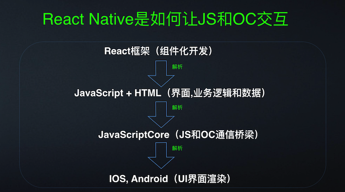
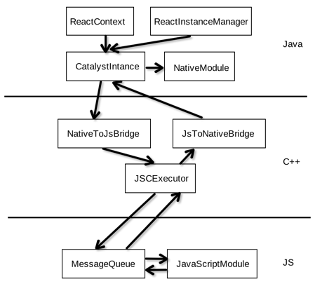
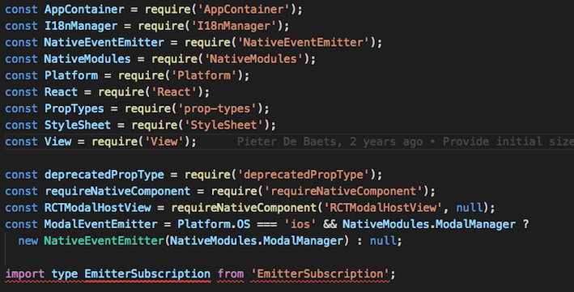
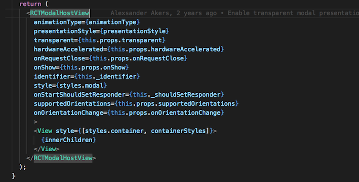

# React Native 底层原理第四章

  通过前面几章, 对 React Native 的发展、语法、架构等都有了一定的了解, 熟悉了这些之后也应该能够独立的构建一个应用, 但是 React Native 的原理还是应该明白的, 毕竟轮子是别人的, 知识是自己的, 只有明白的 React Native 的底层原理, 才有可能自己造轮子, 退一万步讲, 明白了原理, 用起 React Native 这门框架来才能够行云流水, 这一章, 主要是对 React Native 的底层原理做一些探究, 并用 RN 中的组件当作例子来深挖 React Native.


  ## 简述 RN 原理`4.1`

  React Native 是在 Native App 里面引入了一个脚本语言, 就像 JavaScript 在 `遥控` 一个 Native App. React Native 会在一开始生成 OC 模块表, 然后将这个模块表导入 JavaScript 中, JS 参照模块表, 就能够间接的调用 OC 的代码, 这样说可能有一些抽象, 举个例子: 相当于买了一台电视机(OC), 有一个遥控板, 当我们拿着遥控板按下1, 它就跳到1频道, 按下2, 它就跳到2频道, 我们并不需要知道为什么按1电视机就跳转到1频道, 也不需要知道它是怎么跳转到1频道的, 这些制造这台电视的工程师们已经帮我们封装好了这些操作, 设定1代表的是1频道, 2代表的是2频道. React Native 也是一样的, 其实 App 底层的实现都是`原生 API`, 但是 React Native 帮我们封装好了很多的操作, 而且对应有一份 OC 表, 我们只需要对着 React Native 封装好的说明书来就可以了, 因此, 使用 React Native 开发出来的就是 原生的 App 了.

  Android 和 IOS 不一定要分开讲述, 因为 React Native 处理 Android 和 IOS 的时候用的都是同一套逻辑, 就是用 `JavaScript` 去调用原生 API, 而且 React Native 将原生接口都封装好了, 使用同一个组件, Android 下和 IOS 下的 UI 是差不多一模一样的, 但是 Android 和 IOS 有太多的不同点了, 包括语言, 包括布局, 因此 React Native 不能够保证所有的 API 在 Android 和 IOS 下都是一样的效果, 因为将两种不同的操作系统联系在一起本身就很难了, 不过随着 React Native 的发展, 从 0.19 到现在的0.50, RN 修复了很多 bug, 在两个系统的兼容性上面也越来越好了

## JavaScript 语言与 Native 语言的交互`4.2`



IOS 原生 API 有一个 JavaScriptCore 框架, 通过它就能够实现 JavaScript 和 Object-C 的交互, 当我们写好 JSX 代码后, 经过解析会将 JSX 代码编译为 JavaScript 代码, 之后呢, Object-C 读取 JavaScript 并利用 JavaScriptCore 执行, 执行完毕会返回一个数组, 数组中描述 Object-C 对象, 属性, 方法等等.



Android 与IOS 类似, 不过它并不像IOS 那样, 有 JavaScriptCore 框架能够直接解析 JS 代码, 在 Android 的实现中, 一共分为三层, JS, C++, JAVA. 首先是 JS 层, 当我们使用 React Native 框架将页面写好之后, 经过编译就会得到纯的 JS 文件, 之后就是 JS 与 C++ 层的交互了, C++ 中的 JSCExecutor 模块能够加载和执行 JS 代码, 其功能与 IOS 的 JavaScriptCore 框架类似, 通过 JsToNativeBridge 与 JAVA 层交互, 至于跨语言之间的通信暂时可不深究.



## 组件分析`4.3`

  以最普通的 Button 组件来分析, 在 RN 0.50版本的/Libraries/Components/Button.js 下包含 Button 组件所有的介绍.

  ```JavaScript
  const ColorPropType = require('ColorPropType');
  const Platform = require('Platform');
  const React = require('React');
  const PropTypes = require('prop-types');
  const StyleSheet = require('StyleSheet');
  const Text = require('Text');
  const TouchableNativeFeedback = require('TouchableNativeFeedback');
  const TouchableOpacity = require('TouchableOpacity');
  const View = require('View');

  const invariant = require('fbjs/lib/invariant');

  class Button extends React.Component<{
    title: string,
    onPress: () => any,
    color?: ?string,
    accessibilityLabel?: ?string,
    disabled?: ?boolean,
    testID?: ?string,
  }> {
    static propTypes = {
      /**
      * Text to display inside the button
      */
      title: PropTypes.string.isRequired,
      /**
      * Text to display for blindness accessibility features
      */
      accessibilityLabel: PropTypes.string,
      /**
      * Color of the text (iOS), or background color of the button (Android)
      */
      color: ColorPropType,
      /**
      * If true, disable all interactions for this component.
      */
      disabled: PropTypes.bool,
      /**
      * Handler to be called when the user taps the button
      */
      onPress: PropTypes.func.isRequired,
      /**
      * Used to locate this view in end-to-end tests.
      */
      testID: PropTypes.string,
    };

    render() {
      const {
        accessibilityLabel,
        color,
        onPress,
        title,
        disabled,
        testID,
      } = this.props;
      const buttonStyles = [styles.button];
      const textStyles = [styles.text];
      if (color) {
        if (Platform.OS === 'ios') {
          textStyles.push({color: color});
        } else {
          buttonStyles.push({backgroundColor: color});
        }
      }
      const accessibilityTraits = ['button'];
      if (disabled) {
        buttonStyles.push(styles.buttonDisabled);
        textStyles.push(styles.textDisabled);
        accessibilityTraits.push('disabled');
      }
      invariant(
        typeof title === 'string',
        'The title prop of a Button must be a string',
      );
      const formattedTitle = Platform.OS === 'android' ? title.toUpperCase() : title;
      const Touchable = Platform.OS === 'android' ? TouchableNativeFeedback : TouchableOpacity;
      return (
        <Touchable
          accessibilityComponentType="button"
          accessibilityLabel={accessibilityLabel}
          accessibilityTraits={accessibilityTraits}
          testID={testID}
          disabled={disabled}
          onPress={onPress}>
          <View style={buttonStyles}>
            <Text style={textStyles} disabled={disabled}>{formattedTitle}</Text>
          </View>
        </Touchable>
      );
    }
  }

  const styles = StyleSheet.create({
    button: Platform.select({
      ios: {},
      android: {
        elevation: 4,
        // Material design blue from https://material.google.com/style/color.html#color-color-palette
        backgroundColor: '#2196F3',
        borderRadius: 2,
      },
    }),
    text: Platform.select({
      ios: {
        // iOS blue from https://developer.apple.com/ios/human-interface-guidelines/visual-design/color/
        color: '#007AFF',
        textAlign: 'center',
        padding: 8,
        fontSize: 18,
      },
      android: {
        color: 'white',
        textAlign: 'center',
        padding: 8,
        fontWeight: '500',
      },
    }),
    buttonDisabled: Platform.select({
      ios: {},
      android: {
        elevation: 0,
        backgroundColor: '#dfdfdf',
      }
    }),
    textDisabled: Platform.select({
      ios: {
        color: '#cdcdcd',
      },
      android: {
        color: '#a1a1a1',
      }
    }),
  });

  module.exports = Button;
  ```

  前面 Button 组件中引入的包, 其中, Platfrom 是判断当前使用设备的系统, PropTypes 是规定传递的 props 的类型, 其他几个都是 RN 中的组件, 之后 Button 组件首先用静态的 propTypes 规定了 props 的类型, 如 title 为必传参数且为 string 类型, 而 color 则不是必传参数. 若未传必传参数, 则会抛出 warn 警告.

  而 render 函数是为了渲染页面, 也就是我们所看到的按钮是在 render 中形成的. 在 render 中, 通过 Platform.OS 来区分 IOS 和 Android 系统, 而且不同的系统所使用的默认样式都不一样. 因此可以确定 RN 中对 IOS 和 Android 系统下样式进行了封装, 通过封装, 让我们可以使用一样的组件在 IOS 和 Android 系统下看到的 UI 也是一样的.

## 本章小结

  本章简单介绍了 RN 的原理, JavaScript 于原生语言的交互, IOS 系统下, Object-C 提供一个 JavaScript Core 模块与 JS 交互, 而在 Android 下, 是通过 C++ 这个中间层, C++ 的JSCExecutor 模块能够家在和执行 JS 代码, JsToNativeBridge 模块与 JAVA 层交互, 达到双向交互的效果. 最后通过 Button 组件来剖析 RN, 我们虽然使用 RN 很简单, 也减少了开发 App的周期, 但这背后是无数工程师日日夜夜的奋战, 可敬.


