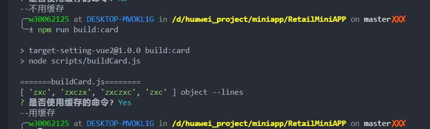
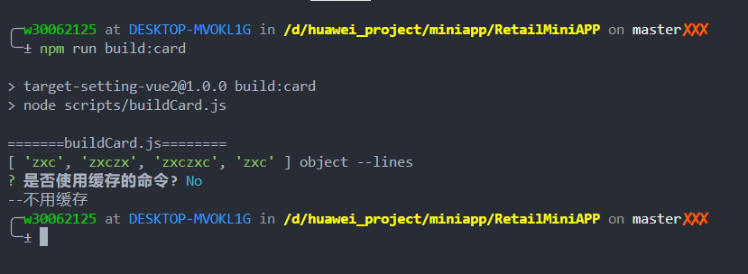

## node 脚本入门

---

## 思考需求

### 什么时候用脚本解决问题、什么适合用脚本解决问题

1. `nodejs` 语言特性
2. 功能特性

## 举例

1. `i18n` 国际化脚本
2. `build:card`、`build:miniapp` 脚本

---

## 学会描述你的问题

1. 描述问题
2. 解决问题（已知知识 + google）

---

## 写 nodejs 脚本常用的包

1. shelljs：执行 node 命令
2. fs: nodejs 自带的，文件系统
3. path: nodejs 自带的，路径系统
4. inquirer：命令行询问、提示
5. chalk: 命令行文字颜色
6. ora: 命令行 loading

---

## 开始一个新的需求

> 某同学的问题：在使用 `build:card` 脚本的时候每次开发的卡片或者页面都是类似的，每次打包都要询问我 打包环境、打包卡片 太麻烦了，能不能让我输入一个命令给存下来，然后再次运行打包脚本可以直接执行?

---

思考：

1. 命令缓存功能
   - 每次运行命令后都缓存下来，然后每次都先展示缓存的命令？
   - 是否都要缓存？

---

1. 命令需要做缓存
   - 缓存文件放置在当前文件夹下，.build_history
   - 缓存以时间戳 + 命令按行存储
2. 初始化的时候先询问是否使用缓存的命令
3. 命令生成后询问是否缓存该命令，默认不缓存
4. 缓存需要设置一个最大值，5 个左右，超出的话就顶掉最久的那一个

**参考**: .zsh_history

---

## 1. 读缓存文件

```js
// 1. 读文件
const data = await fs.readFileSync(
  path.resolve(__dirname, "./.build_history"),
  "utf-8"
);
// 2. 查看读出的文件类型（有ts也可以看到）
console.log(data, typeof data, "--data");
// 3. 拆分成行
// 无数据的时候读出来的是 ['']
const lines = data.split(/\r?\n/).filter(Boolean);
console.log(lines, typeof lines, "--lines");
```

---

## 2. 根据读取的缓存信息询问是否使用缓存

```js
let useCache = null;
if (lines.length) {
  useCache = await inquirer.prompt([
    {
      type: "confirm",
      name: "checked",
      message: "是否使用缓存的命令?",
      default: false,
    },
  ]);
}
// 无数据的时候 useCache 为 null
if (useCache && useCache.checked) {
  console.log("--用缓存");
  return;
}
console.log("--不用缓存");
return;
```

---




---

## 3. 根据选择的缓存命令运行打包

```js
console.log("--用缓存");
const cacheCommanders = await inquirer.prompt([
  {
    type: "list",
    name: "commander",
    message: "选择缓存的命令?",
    choices: lines,
  },
]);
console.log(cacheCommanders.commander, "--a");
console.log(
  chalk.green(`打包命令为：
  ${cacheCommanders.commander}
        `)
);
let begin = Date.now();
const spinner = ora("Loading");
spinner.start();
await sleep(1000);
spinner.stop();
await shell.exec(cacheCommanders.commander);
console.log(
  chalk.green(`
  =======buildCard.js========
  卡片打包完成, 打包时间: ${Date.now() - begin - 1000}ms
  请上传 dist 目录下面的卡片 zip 包
  =======buildCard.js========
  `)
);
return;
```

---

## 4. 打包结束询问是否缓存该命令

```js
const hasCache = await inquirer.prompt([
  {
    type: "confirm",
    name: "checked",
    message: "是否缓存该打包命令?(默认不缓存)",
    default: false,
  },
]);
if (hasCache.checked) {
  try {
    console.log(commander, "--要缓存");
    lines.unshift(commander);
    lines = lines.slice(0, 5);
    await fs.writeFileSync(
      path.resolve(__dirname, "./.build_history"),
      lines.join("\n")
    );
    console.log(
      chalk.green(`
=======缓存命令写入成功========
    `)
    );
  } catch (err) {
    console.log(
      chalk.red(`
=======缓存命令写入失败========
    `)
    );
  }
}
```

---

## 感谢大家，分享结束
