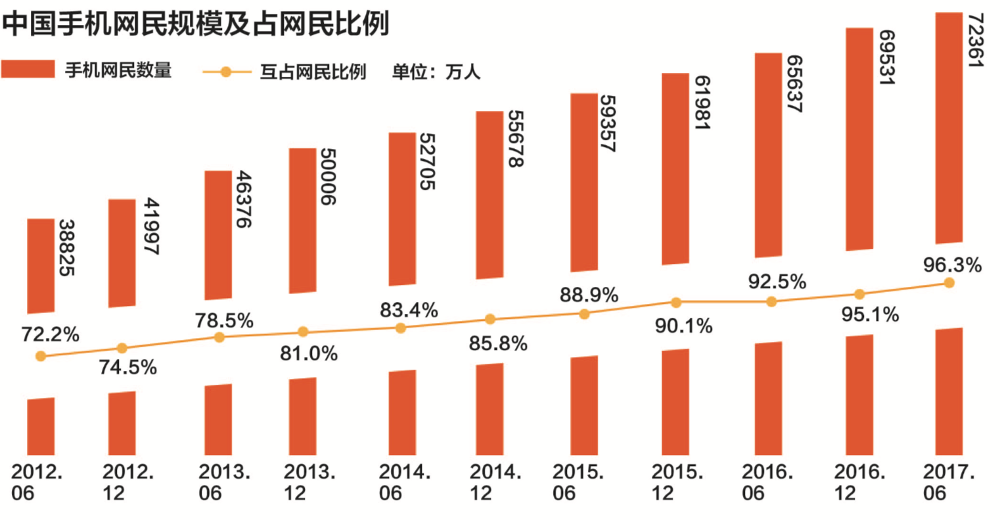
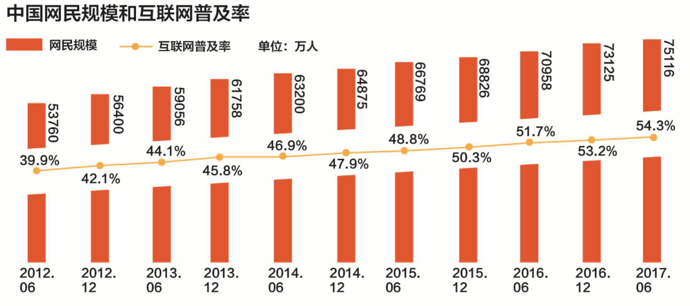
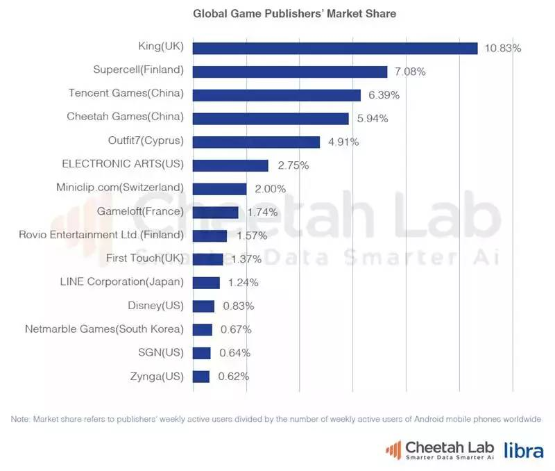
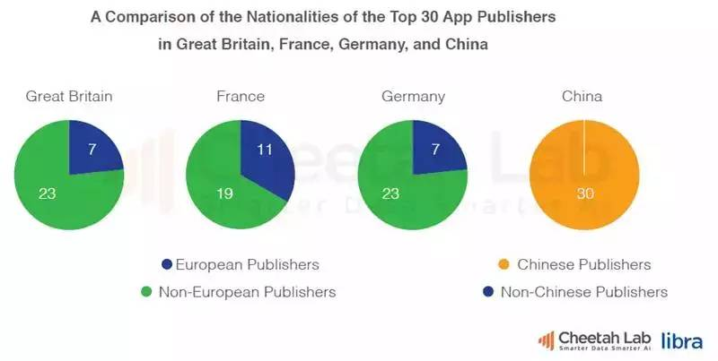
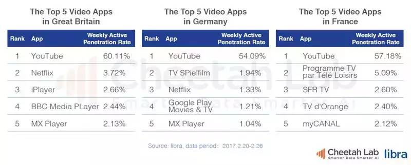

# 国内外移动端应用现状`第一章`
  随着时代和科技的发展, 通信领域逐渐由移动互联网技术占据, 移动互联网技术时移动通信与互联网相互结合之后产生出来的一种新型技术, 移动互联网技术具有非常大的潜在价值, 特别是近几年年来移动互联网的蓬勃发展, 截止到2014年年底, 全球互联网用户数量已经接近30亿, 我国手机用户的数量已经超过12亿, 预计到2020年, 全球互联网用户能够达到250亿`[1]`, 而如此多的互联网用户在日常生活中使用的最多的就是移动端应用 App(Application), 巨大的用户量既是移动互联网发展壮大的机会, 也是对移动端开发技术和开发效率一个极大的挑战, 这是病, 得治, 但只有分析了国内外移动端应用的现状这个病根儿, 才能够对症下药, 药到病除.
## App 的几种类型`1.1`

  自2007年 iPhone 面世以来, 移动互联网就步入了新的时代, 走上了高科技路线, 各种不同的系统, 不一样的平台, 不同的技术、框架层出不穷. 从发展时间上来看, 从2007年到2017年十年时间, 由我们由最初的 Web　网页切换到了移动端App,　当今世界, 移动端应用扮演着至关重要的角色，目前，大众所使用的 App 大致有三种, 分别是 Native App, Web App, Hybrid App, 下面将分别介绍这三种类型的 App 的特点。

  ### Native App`1.1.1`

  Native App 指的是原生的应用, 是一种基于手机操作系统的第三方应用, 比如 IOS 系统, Android系统等等, Native App是一个完整的 App, 它的可扩展性很强, 但是需要用户下载安装使用. 一般情况下, Android 版本的Native App使用 Java 语言编辑, 在常用的Windows环境和Mac环境下都能够进行开发, IOS版本的 Native App 使用 Objective-C 或者 Swift 语言编辑, 只能够在 Mac 环境下开发, 不能在 Windows 环境下开发。

  与其它不同的是, Native App 通常是由 “云服务器数据 + App 应用客户端”两部分构成。 App 应用所有的 UI元素、逻辑框架均安装在手机上, 这也是 Native App 的用户体验优于其它类型的 App 一个主要原因。
  ### Web App`1.1.2`

  Web App, 通俗点说其实就是一个网页, 基于 Web 的应用, 类似于轻应用, Web App 不需要下载和安装, 因此在这方面要优于其他类型的 App, 采用HTML, CSS, JS等技术开发的, 生存在浏览器中, 在某种程度上可以理解为将PC端的网页迁移到了移动端就成为了 Web App.
  ### Habrid App`1.1.3`

  Hybrid App 指的是半原生半 Web 的混合类 App. 需要下载安装, 看上去类似 Native App, 但只有很少的UI Web View, 访问的内容是 Web. 例如 新闻类 App, 视频类 App普遍采用的 Native 的框架, Web 的内容, 这种 App 的好处是看起来比较像原生应用, Hybrid App 极力去打造类似于 Native App 的体验, 但是由于技术和网速的原因, 与 原生应用还是有一些差距.
  ### 三种类型比较`1.1.4`
  ...没写
  ### 小结`1.1.5`

    本节大致介绍了目前市场上流行的几种类型的 App, 并比较了几种类型App的优缺点, 总之是各有千秋, 有好有坏, 如果能够去糟取精, 那么无论是 App 的开发周期还是开发效率都将大大提高, 这也为后面的 React Native 提供了理论依据

## 中国移动端应用现状`1.2`

1. 我国互联网状况`1.2.1`

-  我国互联网已经走过了22年, 其中 2008 年是一个重要的节点, 标志性事件是智能手机以及手机应用有关的 App 商店模式进入市场, 推动我国进入移动互联网时代

 
-  近五年来, 中国网民规模和互联网普及率逐年增长, 截止到 2017年 6月, 我国网民规模达到了 7.5 亿, 普及率为 54.3%, 在这其中, 手机网民数量 7.2亿, 占我国网民 96.3%
-  在 7.5 亿网民中, 在网民年龄方面, 90后占比例最多, 约为 29.7%, 在网民职业方面, 中学生群体占比最高, 达到了 24.8%
-  到2017年6月为止, 我国网络购物用户规模达到 5.14亿, 较2016年底增长 10.2%.
-  手游提速提振, 近四分之一的用户在使用网络直播, 网络游戏用户达到了 4.22亿, 手游用户 3.85亿, 较去年增长 3380 万
-  在网络出行领域, 共享单车用户规模已经达到了 1.61 亿, 网约出租车规模达 2.78 亿, 较去年年底增加 5329 万.

2. 我国互联网发展趋势`[2]` `1.2.2`

- 回想几年前, 2008年 - 2017年 这十年间, 中国互联网大致在一下几个方面发展迅猛

    1. 电子商务

            - 随着淘宝网的出现, 中国的 B2C 业务量迅速增长, 大型的 B2B 以阿里巴巴为首, 蘑菇街, 聚美优品.. 出现了百家争鸣的现象.
    2.  网游
            - 网络游戏一直都是我国互联网的明星产业, 那时候几乎每天都有新的游戏公测、内测, 具有极大的市场

    3.  网络广告

            - 网络广告是互联网公司的命脉, 是许多网站的重要收入来源之一, 即使在现在的2017年, 每年的互联网广告也是不可小觑的
- 不过这在过去的几年中都发展的比较成熟了, 现在又有了新的发展趋势

  根据现有数据分析, 在基础设施建设红利向农村释放、延伸, 移动互联网在精准扶贫中将起到至关重要的作用; 构建大平台生态圈向海外市场延伸; 创新'移动互联网+' 与实体经济深度融合发展着几方面是几个巨大的突破口, 未来的方向所在.
## 国外移动端应用现状`1.3`

根据猎豹智库的《2016全球app发展报告》, 在全球app发行商 Top15中, 美国、中国发行商共计占据13名, 基本垄断了 Top15发行商的榜单.欧洲仅有俄罗斯的 Yandex 跻身前十, 而西欧其他互联网发达的国家如: 德国、英国、法国等则没有进入榜单

与游戏发行商情况相反, 游戏发行商 Top10中有七家来自欧洲的公司, 其中排名榜首的 king 与 supercell 分别来自英国与芬兰

在英国、德国、法国三国中，英国的视频渗透率最高，达到64.55%。在三国的视频app Top5榜单中，Youtube都以绝对的优势抢占第一名。除了丰富的版权内容，大量的免费ugc是支撑Youtube高用户粘性的关键，而排名2-4的Netflix、Google等均是传统视频传媒发行商背景的app，点播视频业务、大量的pgc内容以及影视片源版权是其进行差异化竞争的核心竞争力

## 对比`1.4`

中国属于发展中国家, 而经过上面的分析, 发展中国家与发达国家在移动互联网行业差距明显. 在电商方面, 中国 App 搅动欧洲电商市场, 本土化应用专注二手, 二手交易市场规模庞大; 在 app 发型商上面, 欧洲本土发行商占比均小于 50%, 而中国市场情况则完全不同，中国市场Top30榜单中的app发行公司全部来自本土，无论何种分类的外国发行商app都难以在中国市场收获成功。有一部分原因在于Facebook等巨头目前被排除在中国市场之外.
## 本章小结`1.5`

  本章主要介绍了市场上流行的几种类型的 App, 分别分析了各类型App 的优缺点, 并对国内外的移动端现状进行了分析, 国内近几年的发展越来越趋向于移动端, 而国外则比较平均, 根据分析所得到的结果来看, 国内移动端技术变革已是必然, 尽早进行技术改革, 就早一步抢占先机.

[1]唐博海.移动互联网现状与发展趋势探究[J].通讯世界,2017(22):34-35.
[2]方富贵. 浅析中国互联网的现状及发展趋势[A].河西学院, 2002
[3]谢檬檬. 基于ReactNative的手机百度社交化系统的设计与实现[D].哈尔滨工业大学,2017.

说多了印度、讲惯了美国，欧洲移动互联网的现状怎么样？      http://www.sohu.com/a/129654051_114778