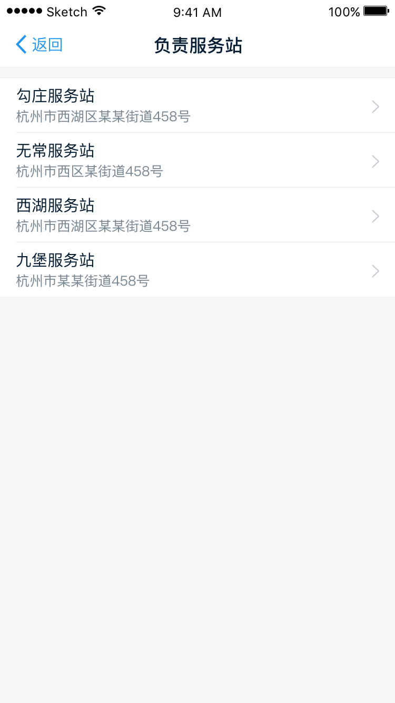
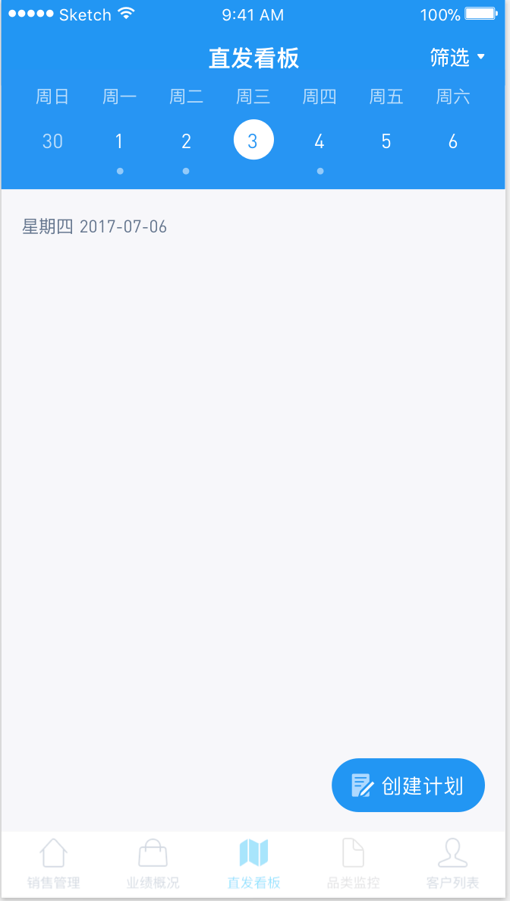
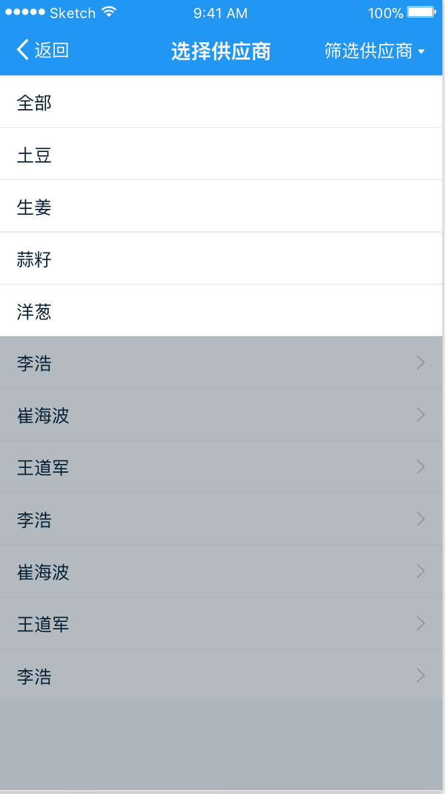
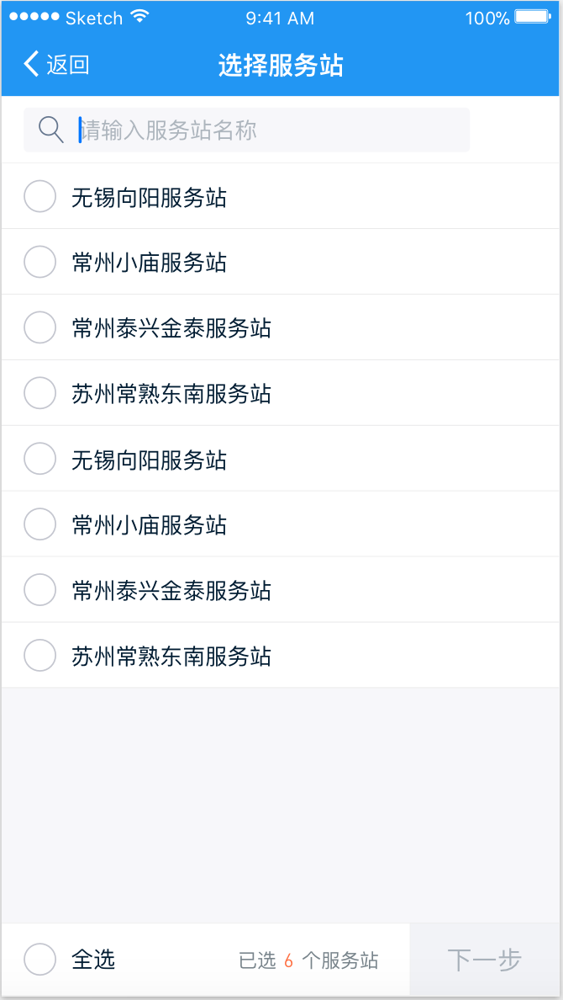
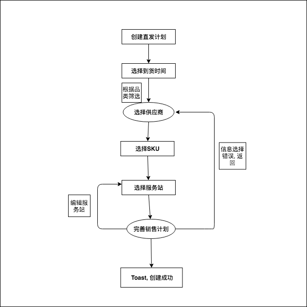

# 基于 React Native 的生鲜销售系统实现

  2016年中央一号文件鼓励涉及农业的企业应用大数据、云计算、物联网、移动网络等新技术推动农业全产业链改造升级, 以 '互联网+农业' 新模式促进农产品电子商务快速发展, 为农民增收、农业增效形成新的突破点 `[1]` , 近年来, 随着马云提出的新零售思想, 各大互联网开始向农业生鲜这一块靠拢, 河马鲜生、京东到家、美菜、喵鲜生等生鲜平台都想在生鲜行业这个大蛋糕中分得一杯羹, 在如今的互联网+时代, 有这样的想法是很正常的, 就农业生鲜行业来说, 这永远都不会是过时的行业, 无论社会、科技如何发展, 但人的衣食住行都是必需品, 单从这一点来说, 做生鲜行业就没错, 加之以往的农业生鲜的运营模式有很大的问题, 举个简单的例子, 一颗普通的蒜子, 从基地收到的价格在 0.5元/斤 - 1元/斤 左右, 但是到了二批市场, 也就是我们消费者购买的市场中就变成了 5元/斤 - 10元/斤 左右, 价格整整提升了十倍, 这不是玩笑话, 而是真正存在在现在的模式当中, 如果能够打通从基地到二批市场的供应链, 那么, 这其中的成本就会低很多, 利润也就很多了, 因此, 此 App 的目的就是为了节约生鲜的运输成本, 直接创建直发计划.

## 需求分析

  个人页:

    销售通过登陆进宋小福, 能够看到自己所属的角色, 负责的品类组, 具体的品类, 负责的服务站, 应用下载的内嵌web页面

  直发页:
    这是本 App 最主要的内容, 其中, 首页需要一个创建直发计划的入口, 通过选择到货时间-> 选择供应商-> 供应商对应的品类信息-> 各品类数量-> 创建成功

  #### 系统业务需求

  个人页:

    个人简介
    负责品类组
    负责服务站
    清除缓存
    应用下载

  直发页:

    创建直发计划
    选择到货时间
    选择供应商
    确认直发计划

    https://www.songxiaocai.com/wap/wapapplist.html
  #### 系统功能需求

UI 设计稿

个人: 

  
  
  
  
  

直发: 

  
  
  
  
  
  
  
  
ER图





## 总体设计

mock 数据:

直发: 

```JavaScript

  // 返回角色负责的品类列表
  // 参数名字: directPlanDate
  {
    "response": [
      {
        "catId": -1,
        "catName": "全部"
      },
      {
        "catId": 61,
        "catName": "土豆"
      },
      {
        "catId": 62,
        "catName": "西红柿"
      }
    ],
    "success": true
  }

  // 返回该供应商能够提供的sku列表
  // 参数名字: query
  {
    "response": [
      {
        "catId": 61,
        "spuName": "山东荷兰15土豆50斤纸箱",
        "arriveDays": 1,
        "packagingTypeStr": "箱",
        "skuId": 1,
        "packagingType": 1,
        "itemSpecies": "基地滕州土豆"
      },
      {
        "catId": 64,
        "spuName": "河北316胡萝卜20斤塑料袋",
        "arriveDays": 0,
        "packagingTypeStr": "袋",
        "skuId": 4,
        "packagingType": 2,
        "itemSpecies": "胡萝卜"
      }
    ],
    "success": true
  }

  // 服务站列表
  {
    "response": [
      {
        "storehouseId": 1,
        "storehouseName": "七宝服务站"
      },
      {
        "storehouseId": 2,
        "storehouseName": "来广营服务站"
      }
    ],
    "success": true
  }

  // 设置供应商该品类的到达时间
  // 参数名字: query
  {
    "response": [
      true
    ],
    "success": true
  }


  // 根据直发计划id和服务站id获取当前直发计划下该服务站的销售计划信息
  // 参数名字: query
  {
    "response": {
      "storehouseId": 1,
      "storehouseName": "服务站1",
      "salePlanWraps": [
        {
          "skus": [
            {
              "spuName": "spu1",
              "skuId": 1
            },
            {
              "spuName": "spu4",
              "skuId": 4
            },
            {
              "spuName": "spu5",
              "skuId": 5
            }
          ],
        "salePlanName": "xxx销售计划1",
        "storehouseArriveEndtime": "1232131231231",
        "storehouseArriveStarttime": "12312312312312"
        },
        {
          "skus": [
            {
            "spuName": "spu1",
            "skuId": 1
            },
            {
            "spuName": "spu3",
            "skuId": 3
            }
          ],
          "salePlanName": "yyy销售计划1",
          "storehouseArriveEndtime": "1232131231231",
          "storehouseArriveStarttime": "12312312312312"
        }
      ]
    },
    "success": true
  }

```

个人:

```JavaScript

  // 销售个人用户信息
  {
    "response": {
      "saleCategoryGroupNum": 0,
      "pickHouseList": [ ],
      "saleUsers": {
        "rolesNum": 0,
        "mobilePhone": "18846179950",
        "roles": [ ],
        "subGroups": [ ],
        "myLeader": "",
        "userName": "吴涛",
        "userId": 29057
      },
      "saleCategoryGroupList": [ ],
      "pickHouseNum": 0
    },
    "success": true
  }

```

  #### 总体架构
  #### 功能结构
  #### 数据库设计
  #### 本章小结

## 
## 测试


## 创建直发计划
## 个人中心


[1]周功建."互联网+"环境下中国农产品电子商务现状及趋势.2016.

