# 基于 React Native 的销售直发系统实现`第五章`

## 开发背景`5.1`

  2016年中央一号文件鼓励涉及农业的企业应用大数据、云计算、物联网、移动网络等新技术推动农业全产业链改造升级, 以 '互联网+农业' 新模式促进农产品电子商务快速发展, 为农民增收、农业增效形成新的突破点 `[1]` , 近年来, 随着马云提出的新零售思想, 各大互联网开始向农业生鲜这一块靠拢, 河马鲜生、京东到家、蚂蚁鲜生、美菜、果小美、鲜生有请、喵鲜生等生鲜平台都想在生鲜行业这个大蛋糕中分得一杯羹, 在如今的互联网+时代, 有这样的想法是很正常的, 就农业生鲜行业来说, 这永远都不会是过时的行业, 无论社会、科技如何发展, 但人的衣食住行都是必需品, 单从这一点来说, 做生鲜行业就没错, 加之以往的农业生鲜的运营模式有很大的问题, 举个简单的例子, 一颗普通的蒜子, 从基地收到的价格在 0.5元/斤 - 1元/斤 左右, 但是到了二批市场, 也就是我们消费者购买的市场中就变成了 5元/斤 - 10元/斤 左右, 价格整整提升了十倍, 这不是玩笑话, 而是真正存在在现在的模式当中, 如果能够打通从基地到二批市场的供应链, 那么, 这其中的成本就会低很多, 利润也就很多了, 因此, 此 App 的目的就是为了节约生鲜的运输成本, 直接创建直发计划, 本文设计并实现了一个基于 React Native 的销售直发系统, 对每一个模块需要具备的功能进行简单说明, 系统的功能包括 用户登陆、个人主页、创建直发计划、选择到货时间、选择供应商、选择SKU、选择服务站、确认直发计划等功能.

## 需求分析`5.2`

  ### 总体业务描述`5.2.1`

    本论文所设计实现的基于 React Native, React Native 的优势在于它结合了 Web 端的应用和 Native(原生)应用, 跨平台的特性使得我们能够同时开发 IOS 和 Android 两种版本的 App, 而开发者只需要学习一种语言就可以开发多种系统的应用, 效率极高, 而且这也极大的减少了项目开发的周期, 减少了项目开发的成本.`[2]`

    本项目大致的流程是这样的, 线下销售通过登陆宋小福, 能够看到个人主页, 里面包括了个人简介, 个人角色, 负责的服务站, 负责的品类组等一系列的信息, 直发页可以创建直发计划, 通过选择到货时间、选择供应商、选择SKU、选择服务站、完善销售计划等一系列的操作最终会创建一个直发计划, 而基地采购通过另外一款 App 能够获取到相应的直发信息, 从而完成采购工作.

    根据以上对本项目的基本功能的分析, 可以将功能分为几个模块: 登陆、个人主页、直发三个大的模块, 具体如图 `5.1.3`

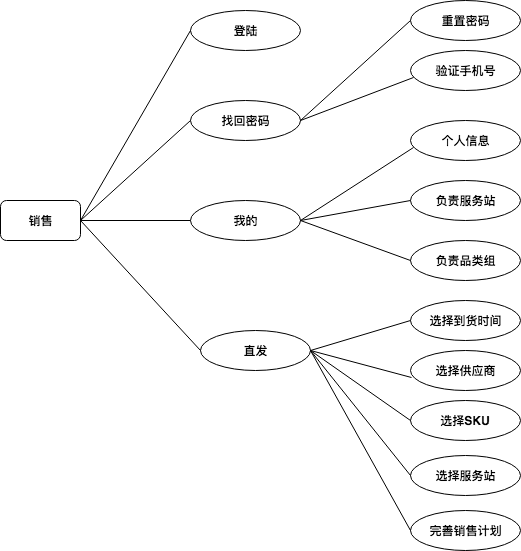

`图5.1.3`

1. 用户登陆: 销售在手机上打开宋小福 App, 通过手机号和密码登陆.
2. 个人主页: 登陆以后点击我的Tab, 可以进入个人页, 可以看到个人的基本信息, 负责的品类组数量, 负责的服务站数量, 应用下载, 退出登陆几个列表.
3. 直发: 进入之后有一个创建直发计划按钮, 点击之后进入选择到货时间页-> 选择供应商-> 选择SKU-> 选择服务站-> 完善销售计划.

  ### UI 设计`5.2.2`

    https://www.songxiaocai.com/wap/wapapplist.html

个人页: 

  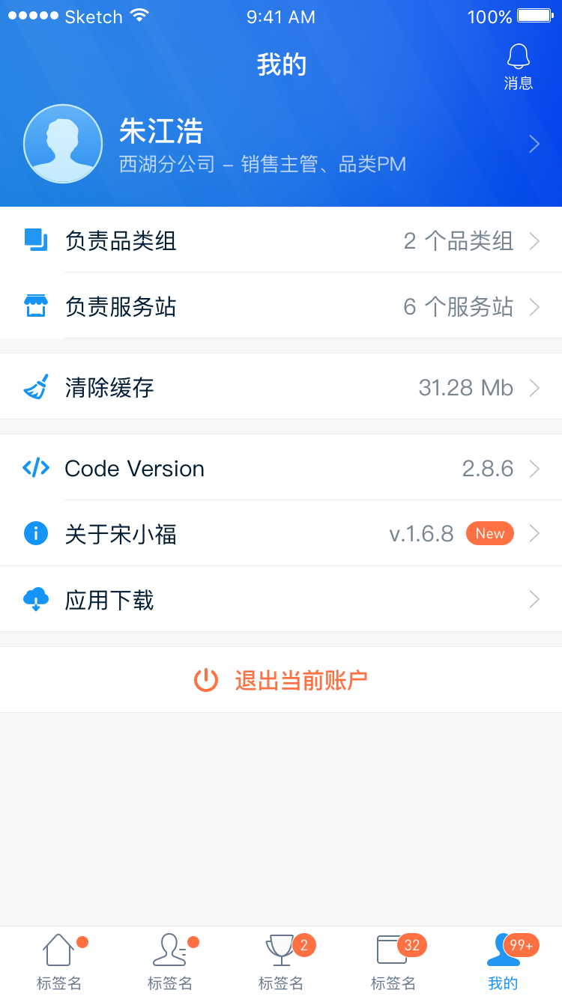
  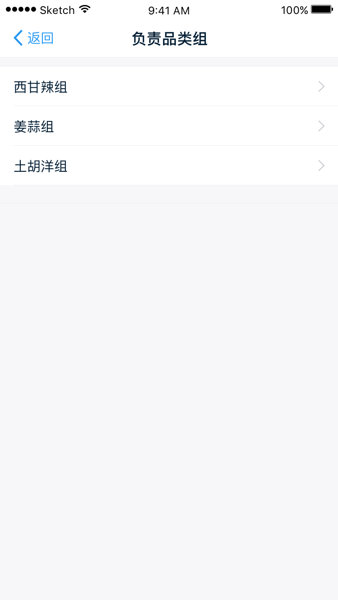
  
  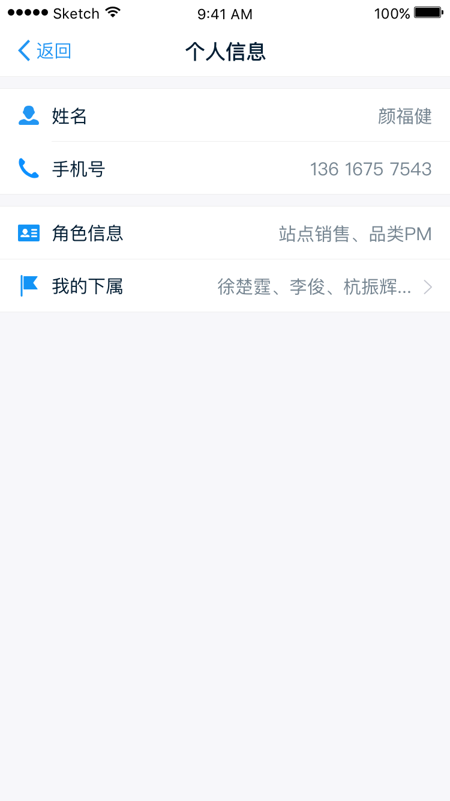
  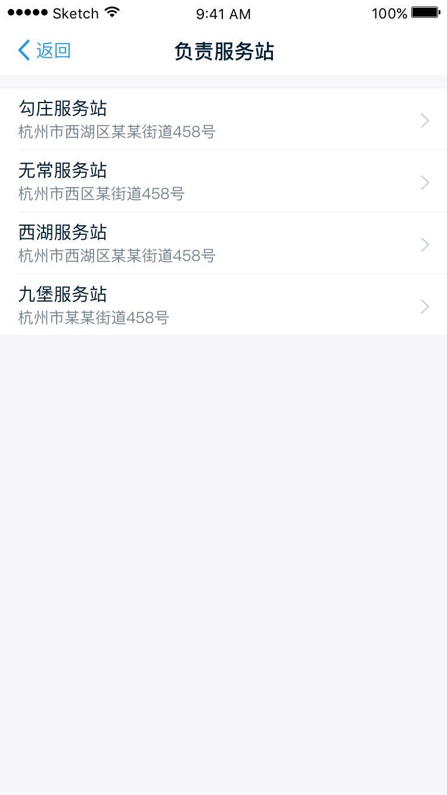

直发: 

  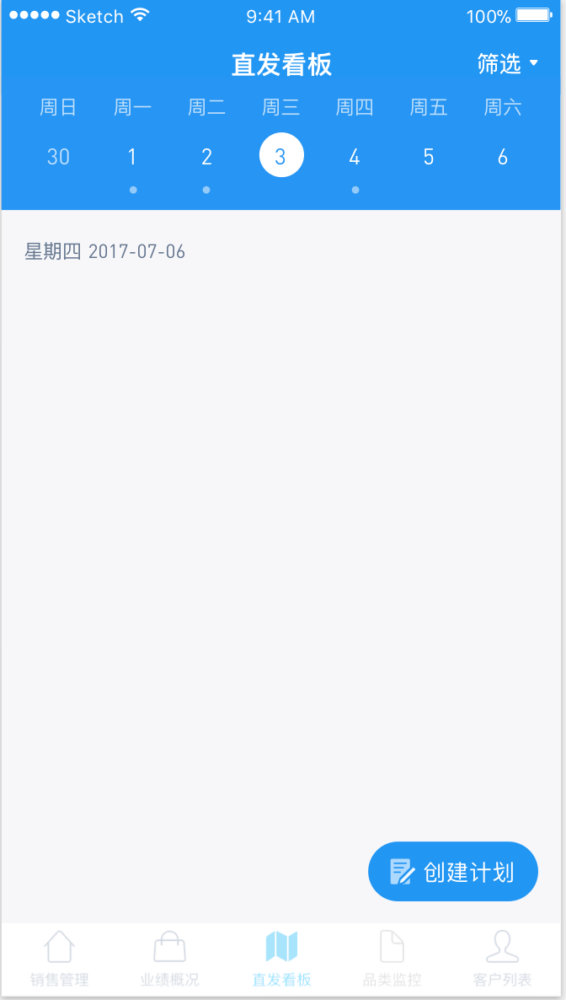
  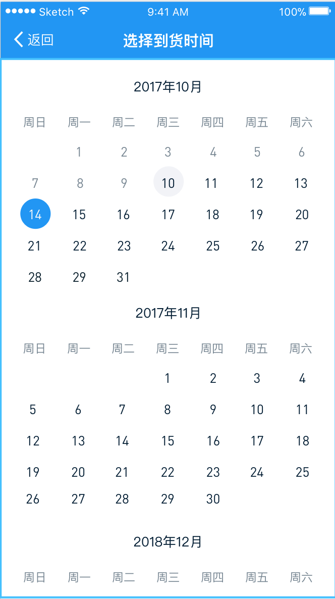
  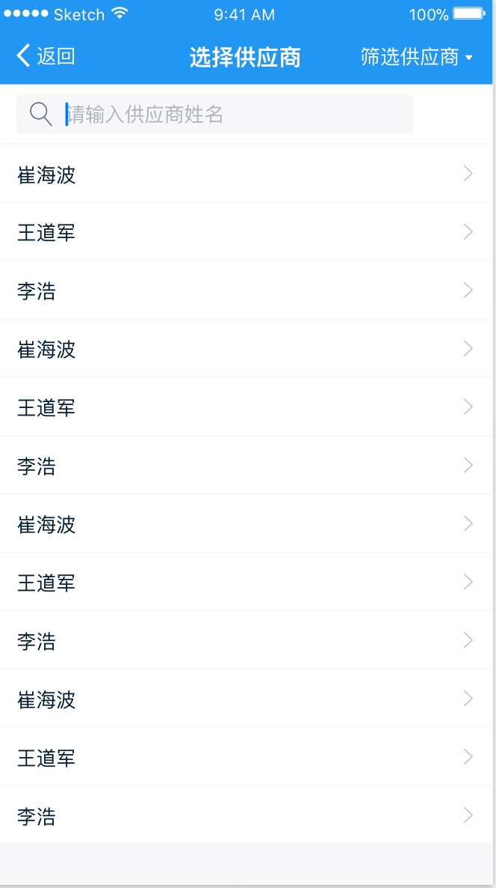
  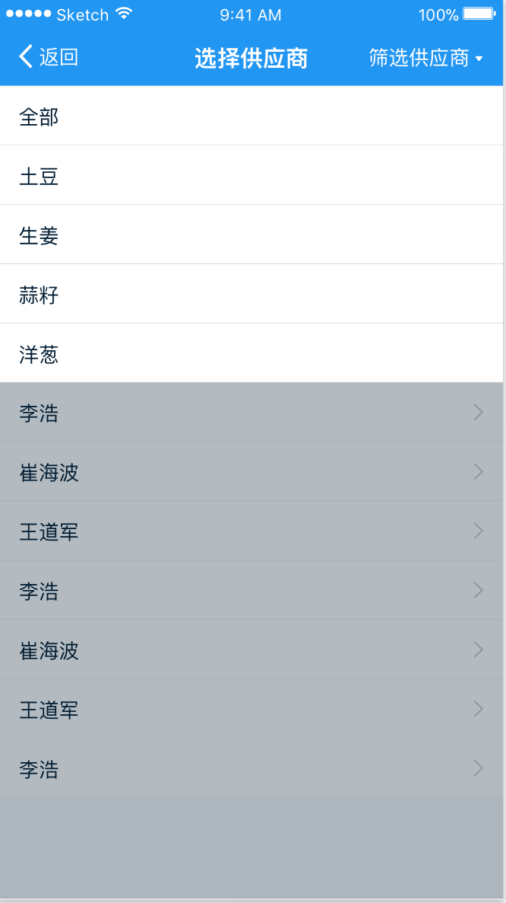
  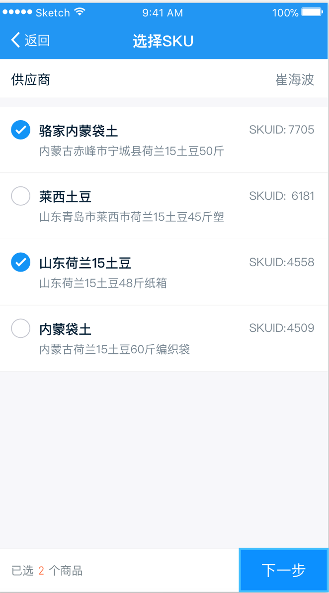
  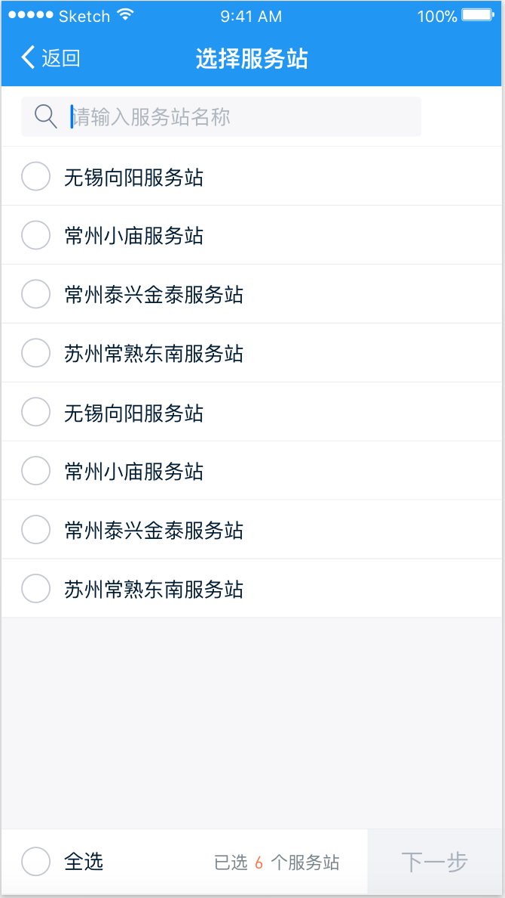
  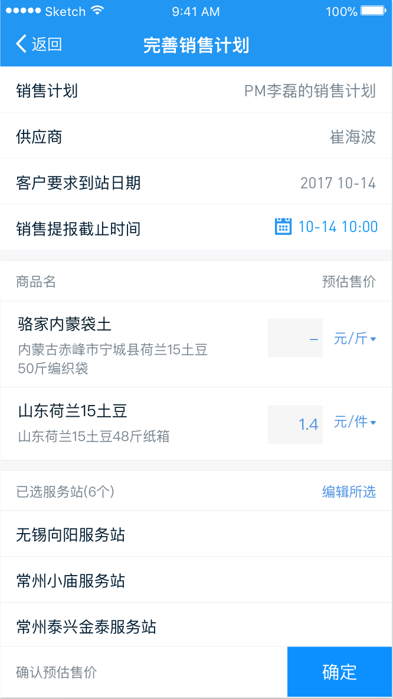
### 流程图`5.2.3`

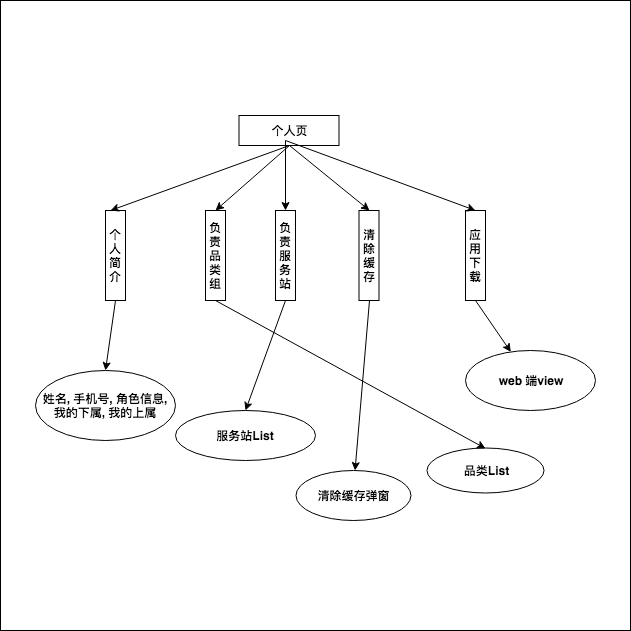
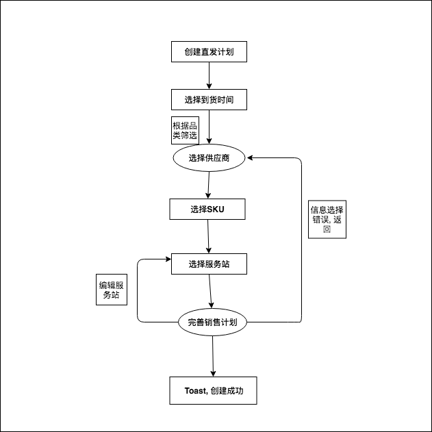

### ER图 `[3]` `5.2.4`

  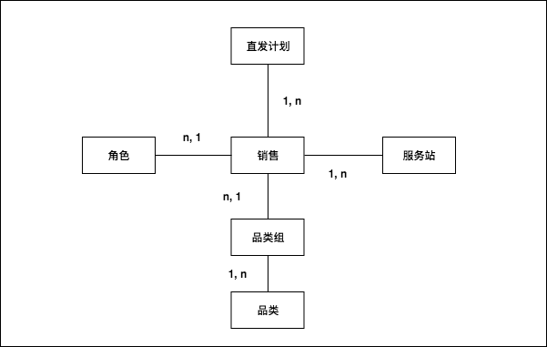
## 总体设计`5.3`
  ### 数据库设计`5.3.1`
  #### 角色负责品类列表的实现`5.3.1.1`
  ```JavaScript
    // 返回角色负责的品类列表
    // 参数名字: directPlanDate
    {
      "response": [
        {
          "catId": -1,
          "catName": "全部"
        },
        {
          "catId": 61,
          "catName": "土豆"
        },
        {
          "catId": 62,
          "catName": "西红柿"
        }
      ],
      "success": true
    }

  ```
  #### 供应商能够提供的sku列表的实现`5.3.1.2`

  ```JavaScript
  
    // 返回该供应商能够提供的sku列表
    // 参数名字: query
    {
      "response": [
        {
          "catId": 61,
          "spuName": "山东荷兰15土豆50斤纸箱",
          "arriveDays": 1,
          "packagingTypeStr": "箱",
          "skuId": 1,
          "packagingType": 1,
          "itemSpecies": "基地滕州土豆"
        },
        {
          "catId": 64,
          "spuName": "河北316胡萝卜20斤塑料袋",
          "arriveDays": 0,
          "packagingTypeStr": "袋",
          "skuId": 4,
          "packagingType": 2,
          "itemSpecies": "胡萝卜"
        }
      ],
      "success": true
    }

  ```
  #### 服务站列表的实现`5.3.1.3`

  ```JavaScript
  
    // 服务站列表
    {
      "response": [
        {
          "storehouseId": 1,
          "storehouseName": "七宝服务站"
        },
        {
          "storehouseId": 2,
          "storehouseName": "来广营服务站"
        }
      ],
      "success": true
    }
  
  ```
  #### 选择到货时间的实现`5.3.1.4`

  ```JavaScript
  
    // 设置供应商该品类的到达时间
    // 参数名字: query
    {
      "response": [
        true
      ],
      "success": true
    }

  ```
  #### 直发计划id和服务站id获取当前直发计划下该服务站的销售计划信息的实现`5.3.1.5`

  ```JavaScript

    // 根据直发计划id和服务站id获取当前直发计划下该服务站的销售计划信息
    // 参数名字: query
    {
      "response": {
        "storehouseId": 1,
        "storehouseName": "服务站1",
        "salePlanWraps": [
          {
            "skus": [
              {
                "spuName": "spu1",
                "skuId": 1
              },
              {
                "spuName": "spu4",
                "skuId": 4
              },
              {
                "spuName": "spu5",
                "skuId": 5
              }
            ],
          "salePlanName": "xxx销售计划1",
          "storehouseArriveEndtime": "1232131231231",
          "storehouseArriveStarttime": "12312312312312"
          },
          {
            "skus": [
              {
              "spuName": "spu1",
              "skuId": 1
              },
              {
              "spuName": "spu3",
              "skuId": 3
              }
            ],
            "salePlanName": "yyy销售计划1",
            "storehouseArriveEndtime": "1232131231231",
            "storehouseArriveStarttime": "12312312312312"
          }
        ]
      },
      "success": true
    }

  ```
  #### 个人信息`5.3.1.6`

  ```JavaScript

    // 销售个人用户信息
    {
      "response": {
        "saleCategoryGroupNum": 0,
        "pickHouseList": [ ],
        "saleUsers": {
          "rolesNum": 0,
          "mobilePhone": "18846179950",
          "roles": [ ],
          "subGroups": [ ],
          "myLeader": "",
          "userName": "吴涛",
          "userId": 29057
        },
        "saleCategoryGroupList": [ ],
        "pickHouseNum": 0
      },
      "success": true
    }

  ```
  ### 具体实现`5.3.2`
  #### 路由`5.3.2.1`

    ```JavaScript
    
    /**
     * @desc    路由梳理
     * @author  吴涛
     * @date    2017/12/01
     */
    import Mine from './mine_component'
    import PersonalDetails from './personal_details'
    import StoreHouseDetails from './store_house_details'
    import CategoryDetails from './category_details'
    import CategoryList from './category_list'
    import RoleInfo from './role_info'
    import SubordinateInfo from './subordinate_info'
    import ToDownload from './to_download'

    export {
      Mine,
      PersonalDetails,
      StoreHouseDetails,
      CategoryDetails,
      CategoryList,
      RoleInfo,
      SubordinateInfo,
      ToDownload
    }
    
    ```

  #### 选择到货时间的实现`5.3.2.2`

    ```JavaScript
      <Page
        title='选择到货时间'
        pageLoding={false}
        barStyle='light-content'
        leftContent={this._renderHeaderLeft()}
      >
        <Calendar
          minDate={minSelectDate}
          maxDate={maxSelectDate}
          selectedDate={selectedDate}
          onDateChange={this._goToChoiceProvider}
          nextTitle={'下一月'}
          previousTitle={'上一月'}
          selectedDayColor='#1d84d6'
          selectedDayTextColor='#ffffff'
          scaleFactor={375}
          textStyle={{fontSize: 13, fontFamily: 'Dinpro'}}
          weekdays={['周日', '周一', '周二', '周三', '周四', '周五', '周六']}
          months={['1', '2', '3', '4', '5', '6', '7', '8', '9', '10', '11', '12']}
        />
      </Page>

      /**
        * @desc   跳转到选择供应商页
        * @author    吴涛
        * @date:   2017/11/23
        */
      _goToChoiceProvider = (deliveryDate) => {
        this.navigator().push('ChoiceProvider', {
          deliveryDate,
          refresh: this.getRouteData('refresh')
        })
      }
    ```
  #### 选择供应商的实现`5.3.2.3`

    ```JavaScript
      <Page
        title='选择供应商'
        pageLoading={pageLoading}
        leftContent={this._renderHeaderLeft()}
        rightContent={this._renderHeadRight()}
        barStyle='light-content'
      >
        <SearchInput changeText={this._searchKeywords} />
        <FlatList
          data={copyRes}
          ListEmptyComponent={this._renderEmpty()}
          renderItem={this._renderProviderList}
          keyExtractor={(item, index) => index}
        />
        <ModalCatSpinner
          ref={(view) => { this._catSpinnerModal = view }}
          catBaseVOList={catlist}
          btnCatItem={this._btnCatItem}
        />
      </Page>
    
      /**
        * @Description: 供应商列表
        * @author       吴涛
        * @date         2017/11/23
      */
      _renderProviderList = ({item}) => {
        const arrowPath = new Path().moveTo(8, 3).lineTo(15, 9.5).lineTo(8, 16)
        return (
          <TouchableOpacity
            style={s.clickProviderListContainer}
            onPress={this._goToChoiceSku(item)}
          >
            <Text style={{flex: 1}} fontSize='$T15' color='$N10'>{item.supplierName}</Text>
            <Text fontSize='$T13' color='$N12' style={{marginLeft: 5}}>{item.confirmEndTimeStr}</Text>
            <Surface width='17' height='20'>
              <Shape d={arrowPath} stroke='rgba(188, 190, 201, 1)' strokeWidth='1' />
            </Surface>
          </TouchableOpacity>
        )
      }

      /**
      * @Description: 跳转到选择sku页面
      * @author       吴涛
      * @date         2017/10/25
      */
      _goToChoiceSku = (item) => () => {
        this.navigator().push('ChoiceSkuList', {
          provider: item.supplierName,
          deliveryDate: this.getRouteData('deliveryDate'),
          supplierId: item.supplierId,
          refresh: this.getRouteData('refresh')
        })
      }
    
    ```
  #### 选择SKU的实现`5.3.2.4`

    ```JavaScript
    
      <Page
        title={'选择SKU'}
        pageLoading={pageLoading}
        leftContent={this._renderHeaderLeft()}
      >
        <View style={s.itemTitle}>
          <Text color='$N11' fontSize='$T13'style={{flex: 1}}>供应商</Text>
          <Text color='$N11' fontSize='$T13'>{this.getRouteData('provider')}</Text>
        </View>
        <FlatList
          refreshControl={this._getRefreshControl()}
          data={skulist}
          renderItem={this._renderItem}
          ListEmptyComponent={this._renderEmpty()}
          keyExtractor={(item, index) => index}
          />
        {this._renderBottomView()}
      </Page>

      /**
      * @Description: 底部view
      * @author       chengfy@songxiaocai.com
      * @date         17/7/17 19:50
      */
      _renderBottomView=() => (
        <View style={s.action_view}>
          <Text fontSize='$T13' color='$N11' >已选</Text>
          <Text fontSize='$T13' color='#FF7043' style={{ marginLeft: 2, marginRight: 2 }} >{this.state.totalSkuNum ? `${this.state.totalSkuNum}` : '0'}</Text>
          <Text fontSize='$T13' color='$N11' style={{ flex: 1 }} >个商品</Text>
          <TouchableOpacity
            onPress={this._goChoiceStoreHouse}
            style={s.btn_next}
          >
            <Text fontSize='$T15' color='white' >下一步</Text>
          </TouchableOpacity>
        </View>
      )

    
      /**
      * @desc      跳转到选择服务站页面
      * @author       吴涛
      * @date         17/7/17 19:57
      */
      _goChoiceStoreHouse=() => {
        const skuIds = []
        const checkedSku = []
        if (!this.state.skulist) {
          return
        }
        this.state.skulist.map((item) => {
          if (item.checked) {
            skuIds.push(item.skuId)
            checkedSku.push(item)
          }
          return null
        })
        if (skuIds.length === 0) {
          global.Toast.show('请至少选择一个商品')
          return
        }
        this.navigator().push('ChoiceStorehouseList', {
          provider: this.getRouteData('provider'),
          deliveryDate: this.getRouteData('deliveryDate'),
          directTime: this.directTime,
          refresh: this.getRouteData('refresh'),
          skuIds,
          skulist: checkedSku,
          supplierId: this.getRouteData('supplierId')
        })
      }
    
    ```
  #### 选择服务站的实现`5.3.2.5`

    ```JavaScript
      <Page
        title={'选择服务站'}
        pageLoading={this.state.pageLoading}
        leftContent={this._renderHeaderLeft()}
      >
        <SearchInput changeText={this._searchKeywords} />
        <FlatList
          refreshControl={this._getRefreshControl()}
          data={this.state.copyPickHouseBases}
          ListEmptyComponent={this._renderEmpty()}
          renderItem={this._renderItem}
          keyExtractor={(item, index) => index}
        />
        {this._renderBottomView()}
      </Page>

    ```

    确认直发计划的实现

    ```JavaScript
      <Page
        title='完善销售计划'
        pageLoading={this.state.pageLoading}
        leftContent={this._renderHeaderLeft()}
      >
        <ScrollView>
          <View
            ref={(ref) => { this.scroll = ref }}
            style={{ flex: 1 }}
            contentContainerStyle={{ flex: 1 }}
          >
            <View style={{ marginBottom: 10 }}>
              <View style={s.row}>
                <Text fontSize='$T15' color='$N10'>计划名称：</Text>
                <View style={s.right}>
                  <Text style={s.directStyle}>{salePlanName}</Text>
                </View>
              </View>
              <View style={s.row}>
                <Text fontSize='$T15' color='$N10'>供应商：</Text>
                <View style={s.right}>
                  <Text fontSize='$T15' color='$N11' style={[s.rightLabel, { flex: 1 }]}>{provider ? this.state.provider : '-'}</Text>
                </View>
              </View>
              <View style={s.row}>
                <Text fontSize='$T15' color='$N10'>客户要求到货日期：</Text>
                <Text fontSize='$T15' color='$N11' style={s.rightLabel}>{str.date(this.getRouteData('deliveryDate')).format('y m-d')}</Text>
              </View>
              <View style={s.row}>
                <Text fontSize='$T15' color='$N10' style={{flex: 1}}>销售提报截止时间：</Text>
                <View style={s.right}>
                  <Image style={{width: 16, height: 16}} source={Icon.IconCalendar} />
                  <DatePicker
                    style={s.datePicker}
                    date={reportArriveTime ? new Date(Number(reportArriveTime)) : undefined}
                    mode='datetime'
                    androidMode='default'
                    format={'MM-DD HH:mm'}
                    confirmBtnText='确定'
                    cancelBtnText='取消'
                    showIcon={false}
                    showMode='datetimeWithoutYear'
                    minDate={reportArriveStartTime ? new Date(Number(reportArriveStartTime)) : undefined}
                    maxDate={reportArriveEndTime ? new Date(Number(reportArriveEndTime)) : undefined}
                    customStyles={{
                      dateText: s.dateText,
                      dateInput: s.dateInput,
                      placeholderText: s.placeholderText,
                      btnTextConfirm: s.btnTextConfirm
                    }}
                    onDateChange={this._changeEndTime}
                  />
                </View>
              </View>
            </View>

            <View style={s.Skumenu}>
              <Text fontSize='$T13' color='$N12'>商品名</Text>
              <View style={s.right}>
                <Text fontSize='$T13' color='$N12'>预估售价</Text>
              </View>
            </View>
            { this._renderContent() }
            <View style={s.selectedStoreHouse}>
              <Text fontSize='$T13' color='$N12'>已选服务站({this.getRouteData('totalStorehouseNum')}个)</Text>
              <TouchableOpacity style={s.right} onPress={() => {
                const cb = this.getRouteData('cb')
                typeof cb === 'function' && cb({
                  reportArriveTime: this.state.reportArriveTime,
                  itemMap: this.state.itemMap,
                  listObj: this.state.listObj,
                  skulist: this.getRouteData('skulist')
                })
                this.navigator().pop()
              }}>
                <Text color='$B1'>编辑所选</Text>
              </TouchableOpacity>
            </View>
            {this._renderStoreHouse()}
          </View>
        </ScrollView>
        {this._renderBottom()}
        {this._renderModal()}
      </Page>
    ```
  #### 个人主页的实现`5.3.2.6`

    ```JavaScript
      <View style={s.contentContainer}>
        <ItemMenu text='负责品类组' data={response.saleCategoryGroupNum ? `${response.saleCategoryGroupNum}` + ' 个品类组' : '-'} icon={Icon.IconCategory} clickEvent={this._goToCategoryDetails} />
        <ItemMenu text='负责服务站' data={response.pickHouseNum ? `${response.pickHouseNum}` + ' 个服务站' : '-'} icon={Icon.IconStoreHouse} style={{marginBottom: 10}} clickEvent={this._goToStoreHouseDetails} />
        <ItemMenu text='清除缓存' data={cacheSize} icon={Icon.IconBroom} style={{marginBottom: 10}} />
        <ItemMenu text='CodeVersion' data={LawrenceUpdater.getLawrenceUpdater().JSCODE_VERSION ? LawrenceUpdater.getLawrenceUpdater().JSCODE_VERSION : '-'} icon={Icon.IconCodeVersion} clickEvent={this._checkUpdate} />
        <ItemMenu text='关于宋小福' data={DeviceInfo.deviceInfo.version} icon={Icon.IconAbout} />
        <ItemMenu text='应用下载' data='' icon={Icon.IconDownload} style={{marginBottom: 10}} clickEvent={this._goToDownloadApp} />
        <TouchableOpacity
          style={s.logoutContainer}
          onPress={this._logout}
          // onLongPress={this._checkUpdate}
          // activeOpacity={0.3}
        >
          <Image source={Icon.IconLogout} style={{width: 18, height: 18, marginRight: 10}} />
          <Text style={s.goOut}>退出当前账户</Text>
        </TouchableOpacity>
        <Text color='$N12' style={s.bottomTip}>产品的意见与反馈请钉钉联系：豆爸 13510567758</Text>
      </View>

        /**
         * @description   跳转到个人信息详情页
         * @author        吴涛
         * @date          2017/12/01
         */
        _goToPersonalDetails = () => {
          // const { userReducer } = this.props
          const { response } = this.state
          this.navigator().push('PersonalDetails', {
            // userName: userReducer.userName,
            // mobilePhone: userReducer.mobilePhone,
            saleUsers: response.saleUsers
          })
        }

        /**
         * @description   跳转到负责服务站详情页
         * @author        吴涛
         * @date          2017/12/01
         */
        _goToStoreHouseDetails = () => {
          // const { userReducer } = this.props
          const { response } = this.state
          if (response.pickHouseNum <= 0) {
            global.Toast.show('暂无负责的服务站 !')
            return
          }
          this.navigator().push('StoreHouseDetails', {
            pickHouseList: response.pickHouseList
          })
        }

        /**
         * @description   跳转到负责品类组详情页
         * @author        吴涛
         * @date          2017/12/01
         */
        _goToCategoryDetails = () => {
          // const { userReducer } = this.props

          const { response } = this.state
          if (response.saleCategoryGroupNum <= 0) {
            global.Toast.show('暂无负责的品类组 !')
            return
          }
          this.navigator().push('CategoryDetails', {
            saleCategoryGroupList: response.saleCategoryGroupList
          })
        }

        /**
         * @description   跳转到App下载页
         * @author        吴涛
         * @date          2017/12/06
         */
        _goToDownloadApp = () => {
          this.navigator().push('ToDownload', {
            url: 'https://www.songxiaocai.com/wap/wapapplist.html'
          })
        }

    ```  
  #### 个人信息页的实现`5.3.2.7`

    ```JavaScript

      <Page
        title={<Text style={{ fontWeight: 'bold', color: '#000' }} fontSize='$T17'>个人信息</Text>}
        barStyle='dark-content'
        leftContent={this._goBack()}
        themeColor='#fff'
      >
        <ItemInfo icon={Icon.IconPeopleBlue} menuInfo='姓名' info={saleUsers.userName} style={{marginTop: 10}} />
        <ItemInfo icon={Icon.IconCall} menuInfo='手机号' info={phone} clickEvent={() => {
          // 点击手机拨打电话功能未完成, 待修复
          // Linking.openURL('tel' + Number(mobilePhone))
            // .catch(() => {
            //   Alert.alert('拨打失败, 请重试!')
            // })
        }} />
        <ItemMenu text='角色信息' data={`${saleUsers.roles.length}` + ' 个角色'} icon={Icon.IconBusinessCard} style={{marginTop: 10}} clickEvent={this._goToRoleInfo} />
        <ItemInfo icon={Icon.IconFlag} menuInfo='我的上级' info={saleUsers.myLeader ? saleUsers.myLeader : '-'} />
        <ItemMenu icon={Icon.IconFlag} text='我的下属' data={_.isEmpty(saleUsers.subGroups) ? '暂无下属' : `${saleUsers.subGroups.length}` + ' 位下属'} clickEvent={this._goToSubordinateInfo} />
      </Page>
    
    ``` 
  #### 角色信息的实现`5.3.2.8`

      ```JavaScript

      <Page
        title={<Text style={{ fontWeight: 'bold', color: '#000' }} fontSize='$T17'>角色信息</Text>}
        barStyle='dark-content'
        leftContent={this._goBack()}
        themeColor='#fff'
      >
        <FlatList
          data={roles}
          renderItem={this._renderItem}
          ListEmptyComponent={this._renderEmpty}
          keyExtractor={(e, i) => i}
          style={{marginTop: 10}}
        />
      </Page>

      /**
        * @desc        渲染角色信息列表
        * @author      吴涛
        * @date        2017/12/11
        */
      _renderItem = ({item}) => {
        return (
          <View style={s.container}>
            <Text style={s.text}>{item.roleName}</Text>
          </View>
        )
      }

      /**
        * @desc        渲染空角色信息列表
        * @author      吴涛
        * @date        2017/12/11
        */
      _renderEmpty = () => {
        return (
          <View style={s.empty}>
            <Text fontSize='$T15' color='$N11'>暂无角色信息</Text>
          </View>
        )
      }
      
      ```
  #### 应用下载的实现`5.3.2.9`

  ```JavaScript

    <Page
      title={<Text style={{ fontWeight: 'bold', color: '#000' }} fontSize='$T17'>应用下载</Text>}
      barStyle='dark-content'
      leftContent={this._goBack()}
      themeColor='#fff'
    >
      <View style={s.container}>
        <WebView
          ref={WEBVIEW_REF}
          source={{uri: url}}
          mixedContentMode='always'
          renderError={this._renderError}
          onNavigationStateChange={(e) => {
            // console.log('e::', e)
            if (e.url === url) {
              return
            }
            Linking.openURL(e.url)
              .then(
                (res) => console.log('调用成功, res:', res))
              .catch(
                (err) => console.log('调用失败, error:', err)
              )
          }}
          // injectJavaScript={() => Alert.alert('injectJavaScript')}
          // injectedJavaScript="console.log('无名氏')"
          javaScriptEnabled={this.state.jsEnabled}
          scalesPageToFit={this.state.isScale}
          domStorageEnabled={this.state.isDomStorage}
          // onShouldStartLoadWithRequest={() => false}
          onError={this._onError}
        />
      </View>
    </Page>

  ```
## 本章小结

xxx

[1]周功建."互联网+"环境下中国农产品电子商务现状及趋势.2016.
[2]程化梅. 基于React Native的即时通讯应用的设计与实现[D].武汉邮电科学研究院,2017.
[3]冯博. 基于React Native框架的兴趣社区Android客户端设计与实现[D].哈尔滨工业大学,2017.

